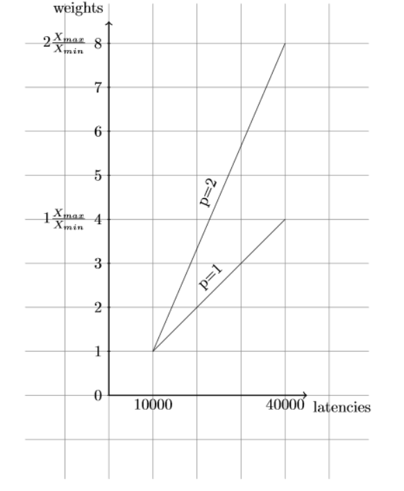

~~~
Disks: Non-Volatile memory controller: Samsung Electronics Co Ltd NVMe SSD Controller 172Xa/172Xb (rev 01) (prog-if 02 [NVM Express])
       Subsystem: Samsung Electronics Co Ltd NVMe SSD Controller 172Xa
~~~

### Test 1

**IO pacing**: `none`

**Configuration**: `config_null_1`

**Initiator**: `fio+SPDK`

| QD         | BW         | WIRE BW    | AVG LAT, us     | BW STDDEV  | L3 Hit Rate     | Bufs in-flight (MiB)      |
|------------|------------|------------|-----------------|------------|-----------------|---------------------------|
| 32         | 129.3      | 137.8114   | 635.6           | 14.9       | 99.2            | 64.0 (8.0)                |
| 64         | 174.1      | 188.4487   | 770.5           | 2.9        | 1.2             | 128.0 (16.0)              |
| 128        | 174.6      | 184.8292   | 1537.5          | 2.5        | .6              | 255.3 (31.9)              |
| 256        | 174.0      | 188.2049   | 3086.3          | 2.9        | .5              | 256.0 (32.0)              |
| 1024       | 174.0      | 181.6536   | 6171.4          | 3.0        | .5              | 255.6 (31.9)              |
| 2048       | 174.3      | 182.9162   | 6159.4          | 2.5        | .5              | 255.3 (31.9)              |

### Test 2

**IO pacing**: `none`

**Configuration**: `config_null_16`

**Initiator**: `fio+SPDK`

**Target CPU mask:** 0xF

| QD         | BW         | WIRE BW    | AVG LAT, us     | BW STDDEV  | L3 Hit Rate     | Bufs in-flight (MiB)      |
|------------|------------|------------|-----------------|------------|-----------------|---------------------------|
| 32         | 184.8      | 196.329    | 362.8           | .1         | 84.6            | 17.0 (2.1)                |
| 64         | 184.8      | 196.3332   | 725.7           | 0          | 78.8            | 84.6 (10.5)               |
| 128        | 184.8      | 196.3337   | 1451.7          | 0          | 77.2            | 187.6 (23.4)              |
| 256        | 184.8      | 196.3346   | 2904.2          | .1         | 59.8            | 398.6 (49.8)              |
| 1024       | 184.7      | 196.3351   | 11342.3         | .2         | 52.5            | 860.6 (107.5)             |
| 2048       | 184.5      | 196.3348   | 13496.5         | .7         | 52.2            | 949.0 (118.6)             |

### Test 3

**IO pacing**: `none`

**Configuration**: `config_nvme`

**Initiator**: `fio+SPDK`

**Target CPU mask:** 0xF
| QD   | BW    | WIRE BW  | AVG LAT, us | BW STDDEV | L3 Hit Rate | Bufs in-flight (MiB) |
|------|-------|----------|-------------|-----------|-------------|----------------------|
| 32   | 180.4 | 191.7512 | 371.6       | .6        | 98.9        | 34.0 (4.2)           |
| 36   | 184.6 | 196.2118 | 408.6       | .2        | 96.8        | 35.6 (4.4)           |
| 40   | 184.4 | 196.2301 | 454.5       | .3        | 95.3        | 37.3 (4.6)           |
| 44   | 178.4 | 194.4846 | 516.7       | 1.8       | 87.9        | 38.3 (4.7)           |
| 48   | 155.5 | 169.8995 | 647.0       | 2.2       | 68.5        | 43.0 (5.3)           |
| 64   | 140.8 | 149.771  | 952.8       | 2.7       | 64.2        | 56.3 (7.0)           |
| 128  | 133.2 | 146.006  | 2013.7      | 3.6       | 62.0        | 150.6 (18.8)         |
| 256  | 130.8 | 148.2463 | 4101.8      | 3.8       | 55.5        | 342.3 (42.7)         |
| 1024 | 124.8 | 130.8902 | 16861.8     | 3.6       | 56.0        | 764.6 (95.5)         |
| 2048 | 120.0 | 129.6406 | 23393.1     | 3.9       | 51.8        | 944.6 (118.0)        |

### Test 4

**IO pacing**: `Limit number of SPDK buffers to 96`

**Configuration**: `NUM_SHARED_BUFFERS=96 config_null_16`

**Initiator**: `fio+SPDK`

**Target CPU mask:** 0xF

| QD         | BW         | WIRE BW    | AVG LAT, us     | BW STDDEV  | L3 Hit Rate     | Bufs in-flight (MiB)      |
|------------|------------|------------|-----------------|------------|-----------------|---------------------------|
| 32         | 184.8      | 196.3354   | 362.8           | .1         | 97.4            | 17.3 (2.1)                |
| 64         | 184.8      | 196.332    | 725.8           | .1         | 94.3            | 38.3 (4.7)                |
| 128        | 184.8      | 196.3329   | 1451.8          | .1         | 93.0            | 56.3 (7.0)                |
| 256        | 184.8      | 196.3356   | 2903.7          | 0          | 92.4            | 52.0 (6.5)                |
| 1024       | 179.4      | 196.3353   | 11982.5         | .3         | 93.8            | 66.0 (8.2)                |
| 2048       | 184.7      | 196.336    | 23248.6         | .8         | 89.2            | 96.0 (12.0)               |

### Test 5

**IO pacing**: `Limit number of SPDK buffers to 96`

**Configuration**: `NUM_SHARED_BUFFERS=96 BUF_CACHE_SIZE=6 config_nvme`

**Initiator**: `fio+SPDK`

**Target CPU mask:** 0xF

| QD         | BW         | WIRE BW    | AVG LAT, us     | BW STDDEV  | L3 Hit Rate     | Bufs in-flight (MiB)      |
|------------|------------|------------|-----------------|------------|-----------------|---------------------------|
| 32         | 180.9      | 191.7578   | 370.6           | .6         | 99.4            | 32.0 (4.0)                |
| 64         | 183.3      | 196.2312   | 731.6           | 1.3        | 88.6            | 47.6 (5.9)                |
| 128        | 183.2      | 196.2073   | 1464.5          | 1.4        | 88.3            | 53.6 (6.7)                |
| 256        | 183.2      | 196.1018   | 2929.6          | 1.4        | 88.4            | 70.0 (8.7)                |
| 1024       | 183.0      | 196.0663   | 11733.6         | 1.3        | 88.4            | 66.3 (8.2)                |
| 2048       | 174.2      | 195.8848   | 24271.7         | 3.2        | 86.7            | 76.3 (9.5)                |

### Test 6

Stability tests. Check variation of results between multiple runs for
different queue depths.

**IO pacing**: `Limit number of SPDK buffers to 96`

**Configuration**: `NUM_SHARED_BUFFERS=96 BUF_CACHE_SIZE=6 config_nvme`

**Initiator**: `fio+SPDK`

| QD         | BW         | WIRE BW    | AVG LAT, us     | BW STDDEV  | L3 Hit Rate     | Bufs in-flight (MiB)      |
|------------|------------|------------|-----------------|------------|-----------------|---------------------------|
| 32         | 181.0      | 192.7453   | 370.4           | .6         | 99.4            | 31.0 (3.8)                |
| 32         | 180.9      | 192.7751   | 370.7           | .6         | 99.3            | 31.3 (3.9)                |
| 32         | 181.0      | 192.7179   | 370.5           | .6         | 99.2            | 31.0 (3.8)                |
| 32         | 180.8      | 191.7542   | 370.8           | .6         | 99.4            | 32.0 (4.0)                |
| 32         | 181.0      | 192.8969   | 370.4           | .6         | 99.4            | 32.0 (4.0)                |
| 32         | 180.8      | 192.8457   | 370.7           | .6         | 99.4            | 32.6 (4.0)                |
| 32         | 181.0      | 192.9574   | 370.4           | .6         | 99.4            | 34.0 (4.2)                |
| 32         | 180.8      | 192.8777   | 370.7           | .7         | 99.3            | 32.0 (4.0)                |
| 32         | 180.7      | 192.1953   | 371.0           | .9         | 99.4            | 33.6 (4.2)                |
| 32         | 180.8      | 192.6212   | 370.8           | .7         | 99.4            | 32.3 (4.0)                |
| 256        | 183.1      | 196.1463   | 2930.8          | 1.4        | 89.4            | 60.0 (7.5)                |
| 256        | 183.1      | 196.1126   | 2931.0          | 1.4        | 87.3            | 53.0 (6.6)                |
| 256        | 183.2      | 196.0903   | 2929.7          | 1.4        | 88.0            | 55.6 (6.9)                |
| 256        | 183.0      | 196.1878   | 2932.1          | 1.4        | 88.0            | 76.6 (9.5)                |
| 256        | 183.0      | 196.1691   | 2933.1          | 1.5        | 87.4            | 61.0 (7.6)                |
| 256        | 183.1      | 196.0661   | 2930.4          | 1.5        | 88.9            | 58.6 (7.3)                |
| 256        | 183.0      | 196.1019   | 2932.5          | 1.5        | 88.2            | 74.6 (9.3)                |
| 256        | 183.0      | 195.978    | 2931.9          | 1.5        | 87.2            | 64.3 (8.0)                |
| 256        | 183.1      | 196.0122   | 2930.5          | 1.3        | 88.5            | 64.3 (8.0)                |
| 256        | 183.1      | 196.1323   | 2930.7          | 1.4        | 88.1            | 69.0 (8.6)                |
| 1024       | 182.7      | 196.1498   | 11752.6         | 1.6        | 87.3            | 70.0 (8.7)                |
| 1024       | 182.5      | 195.8226   | 11763.6         | 1.6        | 86.8            | 68.6 (8.5)                |
| 1024       | 182.6      | 196.1195   | 11755.7         | 1.6        | 87.7            | 80.6 (10.0)               |
| 1024       | 182.3      | 195.8221   | 11776.0         | 1.7        | 86.8            | 74.3 (9.2)                |
| 1024       | 170.8      | 195.2426   | 12570.1         | 7.7        | 86.0            | 85.3 (10.6)               |
| 1024       | 182.6      | 195.8331   | 11760.9         | 1.6        | 87.9            | 70.0 (8.7)                |
| 1024       | 183.0      | 196.1179   | 11736.0         | 1.4        | 88.0            | 63.6 (7.9)                |
| 1024       | 182.8      | 196.1604   | 11746.3         | 1.4        | 88.8            | 63.0 (7.8)                |
| 1024       | 179.2      | 196.0784   | 12215.6         | 3.1        | 87.2            | 69.3 (8.6)                |
| 1024       | 182.9      | 195.9947   | 11736.5         | 1.3        | 90.4            | 67.3 (8.4)                |
| 2048       | 165.0      | 195.6752   | 23453.7         | 7.7        | 87.0            | 69.3 (8.6)                |
| 2048       | 114.1      | 11.7483    | 36052.1         | 20.4       | 90.5            | 61.3 (7.6)                |
| 2048       | 169.9      | 195.7072   | 25239.6         | 8.2        | 86.3            | 72.3 (9.0)                |
| 2048       | 170.3      | 195.7915   | 25208.8         | 6.9        | 88.0            | 80.6 (10.0)               |
| 2048       | 159.7      | 195.8313   | 24719.4         | 10.2       | 87.8            | 67.0 (8.3)                |
| 2048       | 182.8      | 195.9518   | 23482.9         | 1.8        | 88.6            | 66.6 (8.3)                |
| 2048       | 159.5      | 196.1289   | 24218.8         | 8.9        | 97.3            | 68.6 (8.5)                |
| 2048       | 156.2      | 196.1796   | 22841.8         | 13.1       | 97.3            | 74.6 (9.3)                |
| 2048       | 171.9      | 195.8958   | 24800.2         | 7.5        | 86.3            | 77.3 (9.6)                |
| 2048       | 152.1      | 196.0882   | 26380.5         | 10.3       | 88.0            | 56.3 (7.0)                |

### Test 7

Check performance effect of number of target cores.

**IO pacing**: `Limit number of SPDK buffers to 96`

**Configuration**: `NUM_SHARED_BUFFERS=96 BUF_CACHE_SIZE=$((num_buffers/num_cores)) config_nvme`

**Initiator**: `fio+SPDK`

Target cores 16 (0xFFFF). Buffer cache size 6

| QD         | BW         | WIRE BW    | AVG LAT, us     | BW STDDEV  | L3 Hit Rate     | Bufs in-flight (MiB)      |
|------------|------------|------------|-----------------|------------|-----------------|---------------------------|
| 32         | 153.2      | 186.9358   | 437.7           | 15.5       | 99.5            | 12.0 (1.5)                |
| 64         | 172.6      | 193.1896   | 777.2           | 10.4       | 96.0            | 31.0 (3.8)                |
| 128        | 173.9      | 194.2205   | 1542.7          | 9.1        | 96.2            | 33.3 (4.1)                |
| 256        | 176.5      | 194.7853   | 3041.5          | 6.9        | 95.5            | 32.0 (4.0)                |
| 1024       | 156.5      | 195.4675   | 12362.3         | 15.8       | 91.8            | 38.3 (4.7)                |
| 2048       | 119.9      | 0          | 27286.3         | 19.4       | 92.1            | 60.0 (7.5)                |
| 32         | 180.8      | 192.6718   | 370.9           | .8         | 99.4            | 34.0 (4.2)                |
| 64         | 183.0      | 196.1263   | 733.0           | 1.6        | 88.7            | 53.3 (6.6)                |
| 128        | 183.0      | 195.8787   | 1466.2          | 1.6        | 89.0            | 59.6 (7.4)                |
| 256        | 182.8      | 195.9895   | 2935.5          | 1.6        | 88.8            | 68.3 (8.5)                |
| 1024       | 182.3      | 195.9019   | 12142.4         | 1.8        | 87.4            | 82.0 (10.2)               |
| 2048       | 166.1      | 195.6884   | 22845.2         | 10.9       | 87.7            | 77.6 (9.7)                |
| 32         | 181.0      | 192.5283   | 370.5           | .6         | 99.4            | 32.6 (4.0)                |
| 64         | 183.2      | 196.1701   | 732.2           | 1.4        | 88.6            | 48.0 (6.0)                |
| 128        | 183.0      | 195.8798   | 1466.0          | 1.5        | 87.7            | 48.3 (6.0)                |
| 256        | 183.2      | 196.1189   | 2930.1          | 1.4        | 89.6            | 52.3 (6.5)                |
| 1024       | 183.0      | 196.2159   | 11734.6         | 1.3        | 89.4            | 58.6 (7.3)                |
| 2048       | 182.6      | 196.1293   | 23509.2         | 1.8        | 87.2            | 67.0 (8.3)                |
| 32         | 179.2      | 190.7738   | 374.0           | .7         | 99.4            | 31.3 (3.9)                |
| 64         | 183.9      | 196.2118   | 729.4           | 1.0        | 92.2            | 48.3 (6.0)                |
| 128        | 184.3      | 196.2666   | 1455.6          | .5         | 93.5            | 48.0 (6.0)                |
| 256        | 184.5      | 196.2601   | 2908.8          | .3         | 95.1            | 48.0 (6.0)                |
| 1024       | 184.5      | 196.2306   | 11635.5         | .2         | 95.4            | 48.0 (6.0)                |
| 2048       | 184.5      | 196.1993   | 23277.8         | .1         | 96.3            | 48.0 (6.0)                |
| 32         | 166.7      | 177.5174   | 402.2           | .5         | 99.5            | 64.0 (8.0)                |
| 64         | 177.2      | 189.0323   | 757.0           | 3.1        | 92.8            | 96.0 (12.0)               |
| 128        | 173.8      | 184.4002   | 1544.0          | 1.3        | 93.2            | 96.0 (12.0)               |
| 256        | 148.8      | 169.6696   | 3606.2          | 6.7        | 92.4            | 96.0 (12.0)               |
| 1024       | 66.5       | 21.5698    | 34186.5         | 16.9       | 92.9            | 96.0 (12.0)               |
| 2048       | |          | 96.0       | 91.2            | |          |                 |  ()                       |

### Test 8

Check performance effects of buffer cache size.

**IO pacing**: `Limit number of SPDK buffers to 96`

**Configuration**: `NUM_SHARED_BUFFERS=96 BUF_CACHE_SIZE=$buf_cache_size config_nvme`

**Initiator**: `fio+SPDK`

Buffer cache size 6.

| QD         | BW         | WIRE BW    | AVG LAT, us     | BW STDDEV  | L3 Hit Rate     | Bufs in-flight (MiB)      |
|------------|------------|------------|-----------------|------------|-----------------|---------------------------|
| 32         | 153.3      | 186.9712   | 437.5           | 15.6       | 99.5            | 11.0 (1.3)                |
| 64         | 169.2      | 192.4679   | 792.9           | 11.9       | 96.7            | 28.0 (3.5)                |
| 128        | 172.0      | 192.624    | 1559.8          | 10.8       | 96.0            | 36.0 (4.5)                |
| 256        | 176.9      | 194.9639   | 3034.1          | 6.6        | 95.7            | 40.0 (5.0)                |
| 1024       | 155.9      | 195.5284   | 12814.8         | 9.9        | 94.8            | 29.0 (3.6)                |
| 2048       | 126.2      | 192.0534   | 23192.4         | 16.7       | 90.9            | 58.3 (7.2)                |
| 32         | 165.1      | 187.1082   | 406.1           | 11.8       | 99.5            | 35.3 (4.4)                |
| 64         | 172.3      | 194.7679   | 778.4           | 10.3       | 96.4            | 43.0 (5.3)                |
| 128        | 175.4      | 194.5688   | 1530.0          | 8.2        | 97.2            | 58.0 (7.2)                |
| 256        | 176.4      | 195.7395   | 3043.4          | 7.0        | 97.3            | 71.6 (8.9)                |
| 1024       | 171.7      | 192.8975   | 12885.2         | 8.4        | 96.9            | 60.3 (7.5)                |
| 2048       | 167.6      | 194.4482   | 23841.5         | 8.2        | 96.1            | 52.0 (6.5)                |
| 32         | 163.4      | 186.8523   | 410.4           | 12.2       | 99.4            | 32.3 (4.0)                |
| 64         | 172.0      | 192.6385   | 779.8           | 10.8       | 96.1            | 59.0 (7.3)                |
| 128        | 174.6      | 194.3423   | 1536.7          | 8.8        | 95.4            | 58.3 (7.2)                |
| 256        | 175.3      | 194.3333   | 3062.2          | 8.8        | 95.6            | 63.0 (7.8)                |
| 1024       | 180.0      | 195.0608   | 12322.4         | 5.1        | 96.5            | 57.6 (7.2)                |
| 2048       | 177.7      | 195.4205   | 23782.3         | 5.7        | 96.5            | 64.0 (8.0)                |
| 32         | 163.9      | 186.6251   | 409.0           | 12.1       | 99.3            | 37.3 (4.6)                |
| 64         | 170.4      | 191.8494   | 787.1           | 11.1       | 97.4            | 30.0 (3.7)                |
| 128        | 164.4      | 182.1393   | 1631.7          | 7.8        | 97.9            | 62.0 (7.7)                |

### Test 10

Check performance effect of number of data buffers with 4 cores. All
buffers are shared equally between all threads at start with
`BufCacheSize` parameter.

**IO pacing**: `Limit number of SPDK buffers to 96`

**Configuration**: `NUM_SHARED_BUFFERS=$num_buffers BUF_CACHE_SIZE=$((num_buffers/4)) config_nvme`

**Initiator**: `fio+SPDK`

**CPU mask**: 0xF

| Num buffers | Buf cache | QD         | BW         | WIRE BW    | AVG LAT, us     | BW STDDEV  | L3 Hit Rate     | Bufs in-flight (MiB)      |
|-------------|-----------|------------|------------|------------|-----------------|------------|-----------------|---------------------------|
| 128         | 32        | 256        | 139.2      | 146.5161   | 3854.6          | 3.2        | 65.1            | 89.3 (11.1)               |
| 128         | 32        | 1024       | 137.0      | 149.9497   | 15668.3         | 3.3        | 65.5            | 90.0 (11.2)               |
| 96          | 24        | 256        | 182.0      | 196.1142   | 2949.3          | 4.1        | 89.5            | 63.0 (7.8)                |
| 96          | 24        | 1024       | 183.0      | 195.909    | 11735.1         | 1.5        | 88.6            | 69.3 (8.6)                |
| 64          | 16        | 256        | 181.3      | 192.8647   | 2959.8          | .3         | 99.5            | 48.6 (6.0)                |
| 64          | 16        | 1024       | 167.0      | 178.5434   | 12858.3         | 4.9        | 99.4            | 39.6 (4.9)                |
| 48          | 12        | 256        | 157.4      | 166.9114   | 3409.5          | 1.4        | 99.5            | 38.0 (4.7)                |
| 48          | 12        | 1024       | 146.9      | 155.3006   | 14619.3         | 2.4        | 99.4            | 33.0 (4.1)                |
| 44          | 11        | 256        | 151.3      | 159.5022   | 3547.7          | 3.5        | 99.5            | 32.3 (4.0)                |
| 44          | 11        | 1024       | 140.1      | 148.4166   | 15330.6         | 2.8        | 99.4            | 31.6 (3.9)                |
| 40          | 10        | 256        | 141.1      | 150.4636   | 3804.3          | 2.1        | 99.5            | 32.3 (4.0)                |
| 40          | 10        | 1024       | 128.3      | 139.4802   | 16754.5         | 4.9        | 99.4            | 28.6 (3.5)                |
| 36          | 9         | 256        | 132.7      | 141.3987   | 4043.7          | 2.6        | 99.5            | 28.0 (3.5)                |
| 36          | 9         | 1024       | 124.2      | 130.5055   | 17292.0         | 3.4        | 99.4            | 26.0 (3.2)                |
| 32          | 8         | 256        | 121.9      | 129.0161   | 4402.5          | 2.6        | 99.5            | 26.0 (3.2)                |
| 32          | 8         | 1024       | 108.0      | 117.5969   | 19883.4         | 5.0        | 99.4            | 22.6 (2.8)                |
| 24          | 6         | 256        | 95.6       | 102.2675   | 5613.2          | 2.0        | 99.5            | 20.0 (2.5)                |
| 24          | 6         | 1024       | 86.9       | 93.4977    | 24717.3         | 3.9        | 99.4            | 18.0 (2.2)                |
| 16          | 4         | 256        | 65.6       | 69.5475    | 8182.5          | 1.4        | 99.4            | 13.6 (1.7)                |
| 16          | 4         | 1024       | 65.1       | 68.7459    | 32963.8         | 1.7        | 99.4            | 11.6 (1.4)                |

### Test 11

Split each NVMe disk into 3 partitions with SPDK split block device
and build delay block device on top of some partitions.

IO depth is shared equally between all disks. FIO runs 3 jobs with
queue depth of 85 or 341 each. This gives us total IO depth of 255 and
1023 per initiator respectively.

**IO pacing**: `Number of buffers`

**Configuration**: `config_nvme_split3_delay`

**Initiator**: `fio+SPDK`

**CPU mask**: 0xF

| Num buffers | Num delay bdevs | QD  | BW    | WIRE BW  | AVG LAT, us | BW STDDEV | L3 Hit Rate | Bufs in-flight (MiB) |
|-------------|-----------------|-----|-------|----------|-------------|-----------|-------------|----------------------|
| 96          | 0               | 85  | 182.4 | 196.2003 | 2931.2      | 1.4       | 94.4        | 57.6 (7.2)           |
| 96          | 0               | 341 | 172.7 | 196.2555 | 12424.5     | 2.7       | 93.8        | 44.6 (5.5)           |
| 96          | 16              | 85  | 157.4 | 171.0941 | 3398.7      | .4        | 93.6        | 75.0 (9.3)           |
| 96          | 16              | 341 | 136.1 | 161.4393 | 16238.9     | 2.9       | 92.5        | 81.0 (10.1)          |
| 96          | 32              | 85  | 109.4 | 116.0836 | 4886.2      | 1.5       | 88.2        | 75.0 (9.3)           |
| 96          | 32              | 341 | 112.3 | 111.87   | 19210.5     | 4.3       | 87.0        | 84.3 (10.5)          |
| 48          | 0               | 85  | 157.0 | 166.1663 | 3404.0      | .6        | 99.5        | 35.3 (4.4)           |
| 48          | 0               | 341 | 129.4 | 166.1863 | 17297.6     | 3.9       | 99.4        | 39.3 (4.9)           |
| 48          | 16              | 85  | 88.9  | 92.3295  | 6016.8      | 2.0       | 99.3        | 38.6 (4.8)           |
| 48          | 16              | 341 | 89.7  | 89.1863  | 24470.7     | 3.3       | 99.1        | 46.0 (5.7)           |
| 48          | 32              | 85  | 56.5  | 58.6304  | 9466.7      | 1.3       | 99.1        | 39.3 (4.9)           |
| 48          | 32              | 341 | 59.5  | 57.3809  | 36071.5     | 2.6       | 98.9        | 48.0 (6.0)           |

Run2
| Num buffers | Num delay bdevs | QD  | BW    | WIRE BW  | AVG LAT, us | BW STDDEV | L3 Hit Rate | Bufs in-flight (MiB) |
|-------------|-----------------|-----|-------|----------|-------------|-----------|-------------|----------------------|
| 96          | 0               | 85  | 183.8 | 196.2727 | 2908.2      | .3        | 94.8        | 64.3 (8.0)           |
| 96          | 0               | 341 | 180.6 | 196.2773 | 11732.6     | .3        | 94.8        | 56.6 (7.0)           |
| 96          | 16              | 85  | 159.1 | 170.2384 | 3359.0      | 1.4       | 93.5        | 72.0 (9.0)           |
| 96          | 16              | 341 | 132.0 | 161.4572 | 16757.4     | 2.7       | 92.2        | 79.6 (9.9)           |
| 96          | 32              | 85  | 109.5 | 115.4534 | 4883.8      | 1.4       | 88.3        | 79.3 (9.9)           |
| 96          | 32              | 341 | 106.0 | 111.1116 | 20804.9     | 3.5       | 87.1        | 90.3 (11.2)          |
| 48          | 0               | 85  | 155.0 | 165.1953 | 3449.3      | 1.8       | 99.3        | 40.0 (5.0)           |
| 48          | 0               | 341 |       |          | 34.0        | 98.5      |             |                      |
| 48          | 16              | 85  | 87.0  | 92.573   | 6279.9      | 2.2       | 99.3        | 43.0 (5.3)           |
| 48          | 16              | 341 | 88.5  | 88.9342  | 24263.6     | 3.0       | 99.1        | 46.3 (5.7)           |
| 48          | 32              | 85  | 56.1  | 58.1953  | 9537.8      | 1.2       | 99.0        | 42.6 (5.3)           |
| 48          | 32              | 341 | 58.3  | 57.2011  | 36806.4     | 2.3       | 99.0        | 44.6 (5.5)           |

#### With IO Pacer + Disk credit 
Disk credit = 2

*DPDK's atomics*

CPU mask 0xF0, num cores 4, IO pacer period 5750

| Num delay bdevs | QD  | BW    | WIRE BW  | AVG LAT, us | BW STDDEV | L3 Hit Rate | Bufs in-flight (MiB) | Pacer period, us |
|-----------------|-----|-------|----------|-------------|-----------|-------------|----------------------|------------------|
| 0               | 85  | 179.0 | 190.4183 | 13994.5     | .2        | 98.9        | 33.3 (4.1)           | 30.0             |
| 0               | 341 | 154.5 | 183.6431 | 19205.2     | 7.6       | 93.2        | 42.0 (5.2)           | 29.0             |
| 16              | 85  | 172.3 | 182.2516 | 14517.2     | 1.3       | 88.7        | 59.6 (7.4)           | 30.4             |
| 16              | 341 | 146.8 | 174.498  | 24089.1     | 1.8       | 98.2        | 69.0 (8.6)           | 29.5             |
| 32              | 85  | 155.5 | 168.2896 | 16065.0     | 1.0       | 76.8        | 79.0 (9.8)           | 32.8             |
| 32              | 341 | 156.0 | 165.5842 | 22921.6     | .9        | 76.7        | 81.0 (10.1)          | 31.0             |

CPU mask 0xF0, num cores 4, IO pacer period 6000

| Num delay bdevs | QD  | BW    | WIRE BW  | AVG LAT, us | BW STDDEV | L3 Hit Rate | Bufs in-flight (MiB) | Pacer period, us |
|-----------------|-----|-------|----------|-------------|-----------|-------------|----------------------|------------------|
| 0               | 85  | 170.2 | 183.3036 | 14710.6     | 2.0       | 99.2        | 32.0 (4.0)           | 32.1             |
| 0               | 341 | 124.7 | 0        | 26990.2     | 10.5      | 99.4        | 37.6 (4.7)           | 31.4             |
| 16              | 85  | 170.7 | 181.7378 | 14672.4     | .4        | 91.6        | 53.0 (6.6)           | 31.5             |
| 16              | 341 | 164.0 | 181.3291 | 21559.9     | .6        | 91.3        | 57.0 (7.1)           | 30.0             |
| 32              | 85  | 150.1 | 164.1772 | 15884.2     | 2.7       | 76.3        | 81.3 (10.1)          | 33.7             |
| 32              | 341 | 152.3 | 168.2622 | 23497.7     | 1.4       | 77.0        | 79.3 (9.9)           | 31.5             |

*C11's atomics*

CPU mask 0xF0, num cores 4, IO pacer period 5750

| Num delay bdevs | QD  | BW    | WIRE BW  | AVG LAT, us | BW STDDEV | L3 Hit Rate | Bufs in-flight (MiB) | Pacer period, us |
|-----------------|-----|-------|----------|-------------|-----------|-------------|----------------------|------------------|
| 0               | 85  | 164.4 | 169.3166 | 12399.5     | 3.5       | 98.9        | 34.6 (4.3)           | 31.1             |
| 0               | 341 | 154.1 | 176.1927 | 17887.3     | 2.4       | 91.4        | 36.6 (4.5)           | 29.8             |
| 16              | 85  | 165.7 | 180.7495 | 14943.0     | 1.8       | 88.5        | 60.3 (7.5)           | 31.1             |
| 16              | 341 | 158.6 | 176.0715 | 22189.5     | 1.9       | 86.6        | 64.6 (8.0)           | 29.5             |
| 32              | 85  | 154.4 | 74.0855  | 16065.1     | 2.4       | 76.8        | 78.0 (9.7)           | 32.9             |
| 32              | 341 | 150.8 | 160.825  | 22853.9     | 3.1       | 75.5        | 83.3 (10.4)          | 31.4             |

CPU mask 0xF0, num cores 4, IO pacer period 6000

| Num delay bdevs | QD  | BW    | WIRE BW  | AVG LAT, us | BW STDDEV | L3 Hit Rate | Bufs in-flight (MiB) | Pacer period, us |
|-----------------|-----|-------|----------|-------------|-----------|-------------|----------------------|------------------|
| 0               | 85  | 155.9 | 183.2385 | 15846.6     | 3.9       | 97.8        | 33.3 (4.1)           | 32.5             |
| 0               | 341 | 150.7 | 183.3382 | 20567.6     | 11.7      | 98.7        | 36.3 (4.5)           | 31.1             |
| 16              | 85  | 164.8 | 183.142  | 15005.7     | 2.1       | 91.4        | 57.6 (7.2)           | 32.1             |
| 16              | 341 | 166.5 | 181.3099 | 21247.8     | .5        | 91.2        | 57.0 (7.1)           | 30.0             |
| 32              | 85  | 159.1 | 169.4618 | 15742.3     | 1.0       | 77.1        | 79.6 (9.9)           | 32.6             |
| 32              | 341 | 155.6 | 165.807  | 22984.8     | .9        | 76.7        | 85.6 (10.7)          | 31.1             |

### Test 12

Split each NVMe disk into 3 partitions with SPDK split block device
and build delay block device on top of some partitions.

FIO runs 3 jobs with 16 disks each. Job 1 is always delay devices, job
2 may be good (16 delay bdevs) or delay (32 dely bdevs), job 3 is
always good. IO depth is fixed to 256 or 1024 for job 3. For jobs 1
and 2 it is set to value in QD column in the table below. For 32 delay
bdevs effective IO depth is twice the QD since we have 2 jobs each
with it's own IO depth.

**IO pacing**: `Number of buffers`

**Configuration**: `config_nvme_split3_delay`

**Initiator**: `fio+SPDK`

**CPU mask**: 0xF

Job 3 QD is 1024.

| Num buffers | Num delay bdevs | QD | BW    | WIRE BW  | AVG LAT, us | BW STDDEV | L3 Hit Rate | Bufs in-flight (MiB) |
|-------------|-----------------|----|-------|----------|-------------|-----------|-------------|----------------------|
| 96          | 16              | 1  | 182.2 | 196.3114 | 11805.8     | 2.3       | 90.3        | 69.3 (8.6)           |
| 96          | 16              | 2  | 184.3 | 196.3269 | 11697.1     | .2        | 95.5        | 46.6 (5.8)           |
| 96          | 16              | 4  | 184.4 | 196.3296 | 11733.7     | .1        | 96.2        | 44.3 (5.5)           |
| 96          | 16              | 8  | 184.5 | 196.2966 | 11823.3     | .1        | 97.8        | 44.3 (5.5)           |
| 96          | 16              | 16 | 182.1 | 195.5459 | 12159.8     | 2.5       | 98.0        | 47.6 (5.9)           |
| 96          | 16              | 32 | 170.5 | 193.8424 | 13381.4     | 3.6       | 97.8        | 47.0 (5.8)           |
| 96          | 16              | 64 | 162.5 | 189.0824 | 14875.1     | 4.2       | 97.3        | 61.6 (7.7)           |

| Num buffers | Num delay bdevs | QD | BW    | WIRE BW  | AVG LAT, us | BW STDDEV | L3 Hit Rate | Bufs in-flight (MiB) |
|-------------|-----------------|----|-------|----------|-------------|-----------|-------------|----------------------|
| 96          | 32              | 1  | 176.9 | 196.304  | 12164.5     | 4.6       | 92.5        | 63.3 (7.9)           |
| 96          | 32              | 2  | 182.9 | 196.3285 | 11785.4     | 2.3       | 95.3        | 51.6 (6.4)           |
| 96          | 32              | 4  | 184.4 | 196.3102 | 11733.8     | .2        | 96.8        | 45.0 (5.6)           |
| 96          | 32              | 8  | 173.3 | 195.914  | 12582.7     | 5.6       | 98.2        | 56.0 (7.0)           |
| 96          | 32              | 16 | 180.9 | 192.0799 | 12243.0     | .3        | 98.1        | 49.6 (6.2)           |
| 96          | 32              | 32 | 176.7 | 186.8075 | 12911.3     | .5        | 97.3        | 49.3 (6.1)           |
| 96          | 32              | 64 | 158.6 | 176.6669 | 15227.0     | 3.4       | 95.5        | 54.6 (6.8)           |

#### Enumerating through pacing periods
Number of buffers **4095**

CPU mask 0xF0, num cores 4, IO pacer period 5750, adjusted period 23000
| Num delay bdevs | QD | BW    | WIRE BW  | AVG LAT, us | BW STDDEV | L3 Hit Rate | Bufs in-flight (MiB) | Pacer period, us |
|-----------------|----|-------|----------|-------------|-----------|-------------|----------------------|------------------|
| 16              | 1  | 174.4 | 191.5031 | 12342.8     | 3.2       | 98.4        | 35.3 (4.4)           | 30.1             |
| 16              | 2  | 170.2 | 105.488  | 12694.2     | 5.0       | 97.9        | 49.0 (6.1)           | 29.1             |
| 16              | 4  | 178.0 | 191.4605 | 12162.5     | 1.9       | 98.0        | 42.6 (5.3)           | 28.4             |
| 16              | 8  | 149.0 | 163.7612 | 14644.7     | 6.9       | 48.8        | 1372.3 (171.5)       | 28.6             |
| 16              | 16 | 116.4 | 129.2062 | 19152.0     | 1.8       | 45.7        | 1393.0 (174.1)       | 30.0             |
| 16              | 32 | 108.9 | 120.6557 | 20970.3     | 1.6       | 30.6        | 1262.6 (157.8)       | 31.2             |
| 16              | 64 | 105.5 | 109.9268 | 22909.8     | 1.4       | 25.4        | 1094.0 (136.7)       | 32.2             |
| 32              | 1  | 173.2 | 191.7969 | 12289.6     | 4.5       | 98.8        | 41.0 (5.1)           | 30.2             |
| 32              | 2  | 177.8 | 190.4909 | 12127.0     | 1.7       | 97.5        | 44.6 (5.5)           | 28.5             |
| 32              | 4  | 156.8 | 189.69   | 13846.9     | 7.6       | 96.9        | 1121.0 (140.1)       | 28.5             |
| 32              | 8  | 116.1 | 133.6228 | 18754.9     | 5.4       | 80.5        | 1010.3 (126.2)       | 30.2             |
| 32              | 16 | 105.6 | 110.2712 | 20977.4     | 2.1       | 38.2        | 1093.6 (136.7)       | 31.7             |
| 32              | 32 | 104.5 | 110.6193 | 21850.1     | 1.6       | 27.8        | 1039.3 (129.9)       | 32.9             |
| 32              | 64 | 104.3 | 109.8095 | 23199.3     | 1.3       | 23.5        | 1029.0 (128.6)       | 33.8             |

CPU mask 0xF0, num cores 4, IO pacer period 6000, adjusted period 24000
| Num delay bdevs | QD | BW    | WIRE BW  | AVG LAT, us | BW STDDEV | L3 Hit Rate | Bufs in-flight (MiB) | Pacer period, us |
|-----------------|----|-------|----------|-------------|-----------|-------------|----------------------|------------------|
| 16              | 1  | 171.4 | 183.7849 | 12488.4     | 1.6       | 98.8        | 30.0 (3.7)           | 30.8             |
| 16              | 2  | 172.0 | 183.8773 | 12533.3     | .9        | 98.1        | 32.0 (4.0)           | 29.2             |
| 16              | 4  | 171.5 | 182.634  | 12621.2     | 1.6       | 97.9        | 37.0 (4.6)           | 28.8             |
| 16              | 8  | 170.8 | 182.7272 | 12769.6     | 1.9       | 96.7        | 42.0 (5.2)           | 28.5             |
| 16              | 16 | 171.1 | 182.4898 | 12950.5     | 1.3       | 94.5        | 50.3 (6.2)           | 28.3             |
| 16              | 32 | 108.6 | 112.0692 | 21019.0     | 1.7       | 29.6        | 1019.6 (127.4)       | 29.6             |
| 16              | 64 | 106.0 | 109.8919 | 22795.3     | 1.5       | 25.2        | 1283.6 (160.4)       | 30.7             |
| 32              | 1  | 170.1 | 147.1401 | 12595.3     | 2.3       | 98.8        | 29.0 (3.6)           | 31.5             |
| 32              | 2  | 161.1 | 155.1314 | 13381.5     | 3.5       | 98.9        | 35.3 (4.4)           | 30.2             |
| 32              | 4  | 170.5 | 182.8578 | 12697.9     | 2.2       | 97.3        | 32.6 (4.0)           | 29.6             |
| 32              | 8  | 170.2 | 182.2287 | 12819.0     | 2.0       | 95.0        | 50.3 (6.2)           | 29.1             |
| 32              | 16 | 105.8 | 110.4156 | 20937.1     | 2.1       | 38.4        | 1085.3 (135.6)       | 30.7             |
| 32              | 32 | 105.9 | 113.7642 | 21572.8     | 1.7       | 30.4        | 746.3 (93.2)         | 32.0             |
| 32              | 64 | 104.4 | 109.8887 | 23162.7     | 1.3       | 24.0        | 927.0 (115.8)        | 33.0             |

### Test 13

Test latencies with different configurations.

**IO pacing**: `N/A`

**Configuration**: `config_null_16`, `config_nvme`, `config_nvme_split3_delay`

**Initiator**: `fio+SPDK`

**CPU mask**: 0xF

One initiator: spdk04

16 Null disks
| QD | BW   | WIRE BW | AVG LAT, us | BW STDDEV | L3 Hit Rate | Bufs in-flight (MiB) |
|----|------|---------|-------------|-----------|-------------|----------------------|
| 1  | 52.0 | 52.0158 | 19.9        | 1.7       | 99.0        | 0 (0)                |

Local single NVMe disk (SPDK perf)
| QD | BW | WIRE BW | AVG LAT, us | BW STDDEV | L3 Hit Rate |
|----|----|---------|-------------|-----------|-------------|
| 1  | 5.2|         | 200.04      |           |             |

16 NVMe disks
| QD | BW   | WIRE BW | AVG LAT, us | BW STDDEV | L3 Hit Rate | Bufs in-flight (MiB) |
|----|------|---------|-------------|-----------|-------------|----------------------|
| 1  | 4.4  | 4.7265  | 235.6       | 0         | 98.3        | .3 (0)               |

48 split disks (1 job)
| QD | BW   | WIRE BW | AVG LAT, us | BW STDDEV | L3 Hit Rate | Bufs in-flight (MiB) |
|----|------|---------|-------------|-----------|-------------|----------------------|
| 1  | 12.8 | 13.7532 | 243.6       | 0         | 99.0        | 0 (0)                |

48 split+delay disks (1 job)
| QD | BW  | WIRE BW | AVG LAT, us | BW STDDEV | L3 Hit Rate | Bufs in-flight (MiB) |
|----|-----|---------|-------------|-----------|-------------|----------------------|
| 1  | 2.4 | 2.6561  | 1258.5      | 0         | 97.9        | 1.0 (.1)             |

### Test 14

Basic test with rate based IO pacing.

**IO pacing**: `Rate based`

**Configuration**: `config_nvme`

**Initiator**: `fio+SPDK`

**CPU mask**: 0xF0 (4 cores)

FIO with 8 jobs.
CPU mask 0xF0, num cores 4, IO pacer period 5600, adjusted period 22400

| QD   | BW    | WIRE BW  | AVG LAT, us | BW STDDEV | L3 Hit Rate | Bufs in-flight (MiB) | Pacer period, us |
|------|-------|----------|-------------|-----------|-------------|----------------------|------------------|
| 256  | 123.4 | 141.2389 | 4349.3      | 5.3       | 72.0        | 210.0 (26.2)         | 36.5             |
| 1024 | 110.0 | 112.049  | 19522.8     | 5.5       | 46.2        | 889.3 (111.1)        | 37.4             |
| 2048 | 108.2 | 119.9278 | 31971.5     | 5.1       | 53.4        | 671.3 (83.9)         | 38.0             |

CPU mask 0xF0, num cores 4, IO pacer period 5650, adjusted period 22600

| QD   | BW    | WIRE BW  | AVG LAT, us | BW STDDEV | L3 Hit Rate | Bufs in-flight (MiB) | Pacer period, us |
|------|-------|----------|-------------|-----------|-------------|----------------------|------------------|
| 256  | 181.9 | 195.8816 | 2951.3      | 4.0       | 99.0        | 38.0 (4.7)           | 29.7             |
| 1024 | 171.0 | 117.0242 | 12470.5     | 13.0      | 91.5        | 40.0 (5.0)           | 28.7             |
| 2048 | 123.5 | 137.7889 | 34378.8     | 15.0      | 68.2        | 2292.6 (286.5)       | 30.6             |

CPU mask 0xF0, num cores 4, IO pacer period 5700, adjusted period 22800

| QD   | BW    | WIRE BW  | AVG LAT, us | BW STDDEV | L3 Hit Rate | Bufs in-flight (MiB) | Pacer period, us |
|------|-------|----------|-------------|-----------|-------------|----------------------|------------------|
| 256  | 180.0 | 194.4688 | 2981.2      | 3.6       | 99.2        | 38.6 (4.8)           | 30.0             |
| 1024 | 165.3 | 170.6202 | 12991.6     | 11.9      | 98.9        | 554.3 (69.2)         | 29.2             |
| 2048 | 119.3 | 110.2905 | 30436.9     | 15.4      | 54.2        | 1175.3 (146.9)       | 31.2             |

CPU mask 0xF0, num cores 4, IO pacer period 5750, adjusted period 23000

| QD   | BW    | WIRE BW  | AVG LAT, us | BW STDDEV | L3 Hit Rate | Bufs in-flight (MiB) | Pacer period, us |
|------|-------|----------|-------------|-----------|-------------|----------------------|------------------|
| 256  | 178.7 | 192.446  | 3003.4      | 3.8       | 99.4        | 38.6 (4.8)           | 30.8             |
| 1024 | 176.8 | 192.5421 | 12077.6     | 6.9       | 99.3        | 41.0 (5.1)           | 29.0             |
| 2048 | 130.1 | 137.2291 | 27513.1     | 16.2      | 75.6        | 771.0 (96.3)         | 30.5             |

CPU mask 0xF0, num cores 4, IO pacer period 5800, adjusted period 23200

| QD   | BW    | WIRE BW  | AVG LAT, us | BW STDDEV | L3 Hit Rate | Bufs in-flight (MiB) | Pacer period, us |
|------|-------|----------|-------------|-----------|-------------|----------------------|------------------|
| 256  | 177.4 | 191.2322 | 3025.4      | 3.7       | 98.9        | 35.3 (4.4)           | 30.5             |
| 1024 | 172.6 | 182.5691 | 12448.7     | 6.2       | 99.4        | 41.6 (5.2)           | 29.1             |
| 2048 | 133.0 | 119.7292 | 28306.5     | 16.8      | 78.0        | 879.3 (109.9)        | 30.5             |

CPU mask 0xF0, num cores 4, IO pacer period 6000, adjusted period 24000

| QD   | BW    | WIRE BW  | AVG LAT, us | BW STDDEV | L3 Hit Rate | Bufs in-flight (MiB) | Pacer period, us |
|------|-------|----------|-------------|-----------|-------------|----------------------|------------------|
| 256  | 167.6 | 162.2261 | 3204.9      | 7.5       | 99.4        | 30.6 (3.8)           | 32.0             |
| 1024 | 168.4 | 184.8581 | 12453.8     | 7.1       | 98.4        | 37.3 (4.6)           | 30.2             |
| 2048 | 171.6 | 184.7987 | 25037.8     | 3.5       | 99.3        | 38.6 (4.8)           | 29.4             |

Pacer activity instrumentation:

~~~
$TEST_TIME=10 ./test.sh  test_14
test_14
CPU mask 0xF0, num cores 4, IO pacer period 5700, adjusted period 22800
./test.sh: line 279: 78921 Terminated              tail -f > rpc_pipe
| QD         | BW         | WIRE BW    | AVG LAT, us     | BW STDDEV  | L3 Hit Rate     | Bufs in-flight (MiB)      | Pacer period, us
| 2048       | 160.7      | 0          | 26840.1         | 14.6       | 96.2            | 16.3 (2.0)                | 42.0
Bdev avg read lat, us: 281.920987
Poll group: "nvmf_tgt_poll_group_4"
  Pacer calls, polls, ios: 3472681, 545721, 228280
  Pacer poll, io period, us: 37.856 90.498
  Device: "mlx5_0"
    Polls, comps, reqs: 3472681, 188647, 94197
    Comps/poll: .054
    Req lat, us: 349.787
    Req lat (total), us: 7033.646
    Req states 1: [3843,0,246,0,0,0,0,6,0,0,0,1,0,0]
    Req states 2: [4096,0,0,0,0,0,0,0,0,0,0,0,0,0]
    Req states 3: [4096,0,0,0,0,0,0,0,0,0,0,0,0,0]
    Req lat 1, us: 10967.438
    Req lat 2, us: 7033.646
    Req lat 3, us: 7033.646
  Device: "mlx5_1"
    Polls, comps, reqs: 3472681, 267440, 133594
    Comps/poll: .077
    Req lat, us: 1240.831
    Req lat (total), us: 4967.426
    Req states 1: [3844,0,243,0,0,0,0,6,0,0,0,3,0,0]
    Req states 2: [4096,0,0,0,0,0,0,0,0,0,0,0,0,0]
    Req states 3: [4096,0,0,0,0,0,0,0,0,0,0,0,0,0]
    Req lat 1, us: 9082.609
    Req lat 2, us: 4967.426
    Req lat 3, us: 4967.426
Poll group: "nvmf_tgt_poll_group_5"
  Pacer calls, polls, ios: 3235203, 549271, 228619
  Pacer poll, io period, us: 37.611 90.364
  Device: "mlx5_0"
    Polls, comps, reqs: 3235203, 188790, 94171
    Comps/poll: .058
    Req lat, us: 342.736
    Req lat (total), us: 7059.066
    Req states 1: [3647,0,442,0,0,0,0,7,0,0,0,0,0,0]
    Req states 2: [4096,0,0,0,0,0,0,0,0,0,0,0,0,0]
    Req states 3: [4096,0,0,0,0,0,0,0,0,0,0,0,0,0]
    Req lat 1, us: 11007.622
    Req lat 2, us: 7059.066
    Req lat 3, us: 7059.066
  Device: "mlx5_1"
    Polls, comps, reqs: 3235203, 267579, 133566
    Comps/poll: .082
    Req lat, us: 1247.849
    Req lat (total), us: 5095.573
    Req states 1: [3649,0,441,0,0,0,0,5,0,0,0,1,0,0]
    Req states 2: [4096,0,0,0,0,0,0,0,0,0,0,0,0,0]
    Req states 3: [4096,0,0,0,0,0,0,0,0,0,0,0,0,0]
    Req lat 1, us: 9342.326
    Req lat 2, us: 5095.573
    Req lat 3, us: 5095.573
Poll group: "nvmf_tgt_poll_group_6"
  Pacer calls, polls, ios: 1832272, 544689, 230292
  Pacer poll, io period, us: 37.928 89.707
  Device: "mlx5_0"
    Polls, comps, reqs: 1832272, 190396, 94942
    Comps/poll: .103
    Req lat, us: 357.778
    Req lat (total), us: 5096.710
    Req states 1: [3584,0,506,0,0,0,0,6,0,0,0,0,0,0]
    Req states 2: [4096,0,0,0,0,0,0,0,0,0,0,0,0,0]
    Req states 3: [4096,0,0,0,0,0,0,0,0,0,0,0,0,0]
    Req lat 1, us: 7921.196
    Req lat 2, us: 5096.710
    Req lat 3, us: 5096.710
  Device: "mlx5_1"
    Polls, comps, reqs: 1832272, 269194, 134341
    Comps/poll: .146
    Req lat, us: 6655.330
    Req lat (total), us: 6239.003
    Req states 1: [3583,0,505,0,0,0,0,6,0,0,0,2,0,0]
    Req states 2: [4096,0,0,0,0,0,0,0,0,0,0,0,0,0]
    Req states 3: [4096,0,0,0,0,0,0,0,0,0,0,0,0,0]
    Req lat 1, us: 5774.266
    Req lat 2, us: 6239.003
    Req lat 3, us: 6239.003
Poll group: "nvmf_tgt_poll_group_7"
  Pacer calls, polls, ios: 1923407, 546966, 227652
  Pacer poll, io period, us: 37.770 90.748
  Device: "mlx5_0"
    Polls, comps, reqs: 1923407, 188261, 94128
    Comps/poll: .097
    Req lat, us: 351.136
    Req lat (total), us: 7117.839
    Req states 1: [4091,0,1,0,0,0,0,4,0,0,0,0,0,0]
    Req states 2: [4096,0,0,0,0,0,0,0,0,0,0,0,0,0]
    Req states 3: [4096,0,0,0,0,0,0,0,0,0,0,0,0,0]
    Req lat 1, us: 11096.006
    Req lat 2, us: 7117.839
    Req lat 3, us: 7117.839
  Device: "mlx5_1"
    Polls, comps, reqs: 1923407, 267050, 133523
    Comps/poll: .138
    Req lat, us: 1163.454
    Req lat (total), us: 5038.002
    Req states 1: [4092,0,0,0,0,0,0,3,0,0,0,1,0,0]
    Req states 2: [4096,0,0,0,0,0,0,0,0,0,0,0,0,0]
    Req states 3: [4096,0,0,0,0,0,0,0,0,0,0,0,0,0]
    Req lat 1, us: 9311.818
    Req lat 2, us: 5038.002
    Req lat 3, us: 5038.002
~~~

With disk credit = 6 enabled
~~~
CPU mask 0xF0, num cores 4, IO pacer period 5600, adjusted period 22400
| QD         | BW         | WIRE BW    | AVG LAT, us     | BW STDDEV  | L3 Hit Rate     | Bufs in-flight (MiB)      | Pacer period, us
| 256        | 160.9      | 182.7996   | 3334.8          | 8.5        | 91.3            | 36.6 (4.5)                | 31.1
| 1024       | 173.9      | 194.9515   | 12351.6         | 4.4        | 95.5            | 37.0 (4.6)                | 29.2
| 2048       | 145.6      | 161.1026   | 11984.3         | 5.5        | 87.1            | 32.3 (4.0)                | 29.1
CPU mask 0xF0, num cores 4, IO pacer period 5650, adjusted period 22600
| QD         | BW         | WIRE BW    | AVG LAT, us     | BW STDDEV  | L3 Hit Rate     | Bufs in-flight (MiB)      | Pacer period, us
| 256        | 183.3      | 195.2323   | 2928.1          | .9         | 99.3            | 31.3 (3.9)                | 29.8
| 1024       | 159.5      | 169.6107   | 12993.1         | 12.1       | 99.1            | 30.6 (3.8)                | 28.7
| 2048       | 156.8      | 168.7692   | 18836.8         | 7.1        | 91.6            | 22.6 (2.8)                | 28.5
CPU mask 0xF0, num cores 4, IO pacer period 5700, adjusted period 22800
| QD         | BW         | WIRE BW    | AVG LAT, us     | BW STDDEV  | L3 Hit Rate     | Bufs in-flight (MiB)      | Pacer period, us
| 256        | 181.6      | 192.9062   | 2955.0          | 1.3        | 99.4            | 30.6 (3.8)                | 29.8
| 1024       | 170.5      | 193.8426   | 12592.2         | 7.8        | 99.3            | 32.6 (4.0)                | 28.9
| 2048       | 152.9      | 184.7478   | 23730.2         | 14.8       | 95.1            | 51.3 (6.4)                | 28.7
CPU mask 0xF0, num cores 4, IO pacer period 5750, adjusted period 23000
| QD         | BW         | WIRE BW    | AVG LAT, us     | BW STDDEV  | L3 Hit Rate     | Bufs in-flight (MiB)      | Pacer period, us
| 256        | 178.0      | 192.6732   | 3015.7          | 6.9        | 99.4            | 30.0 (3.7)                | 30.2
| 1024       | 141.5      | 164.2529   | 13621.0         | 12.1       | 97.8            | 38.3 (4.7)                | 29.6
| 2048       | 159.0      | 192.1995   | 23207.3         | 12.9       | 99.3            | 42.0 (5.2)                | 29.2
CPU mask 0xF0, num cores 4, IO pacer period 5800, adjusted period 23200
| QD         | BW         | WIRE BW    | AVG LAT, us     | BW STDDEV  | L3 Hit Rate     | Bufs in-flight (MiB)      | Pacer period, us
| 256        | 176.9      | 126.0131   | 3034.1          | 6.7        | 99.4            | 30.6 (3.8)                | 30.6
| 1024       | 158.0      | 190.7169   | 13560.0         | 12.4       | 99.3            | 35.3 (4.4)                | 29.6
| 2048       | 154.5      | 167.761    | 15933.9         | 11.5       | 91.7            | 46.6 (5.8)                | 29.4
CPU mask 0xF0, num cores 4, IO pacer period 6000, adjusted period 24000
| QD         | BW         | WIRE BW    | AVG LAT, us     | BW STDDEV  | L3 Hit Rate     | Bufs in-flight (MiB)      | Pacer period, us
| 256        | 172.6      | 184.5024   | 3109.6          | 1.5        | 99.4            | 28.6 (3.5)                | 31.4
| 1024       | 154.0      | 184.9637   | 13817.3         | 13.8       | 99.4            | 27.6 (3.4)                | 30.3
| 2048       | 163.8      | 183.595    | 22911.2         | 8.7        | 97.3            | 46.0 (5.7)                | 29.7
~~~
### Test 17
Like Test 12 but with *Global Disk Credits* enabled
Split each NVMe disk into 3 partitions with SPDK split block device
and build delay block device on top of some partitions.

FIO runs 3 jobs with 16 disks each. Job 1 is always delay devices, job
2 may be good (16 delay bdevs) or delay (32 dely bdevs), job 3 is
always good. IO depth is fixed to 256 or 1024 for job 3. For jobs 1
and 2 it is set to value in QD column in the table below. For 32 delay
bdevs effective IO depth is twice the QD since we have 2 jobs each
with it's own IO depth.

**IO pacing**: `Number of buffers`

**Configuration**: `config_nvme_split3_delay`

**Initiator**: `fio+SPDK`

**CPU mask**: 0xF

Job 3 QD is 1024.

**Disk Credit**: 6

CPU mask 0xF0, num cores 4, IO pacer period 5750, adjusted period 23000
| Num delay bdevs | QD | BW    | WIRE BW  | AVG LAT, us | BW STDDEV | L3 Hit Rate | Bufs in-flight (MiB) | Pacer period, us |
|-----------------|----|-------|----------|-------------|-----------|-------------|----------------------|------------------|
| 16              | 1  | 171.6 | 190.7852 | 12537.7     | 4.8       | 99.1        | 45.6 (5.7)           | 23.1             |
| 16              | 2  | 170.1 | 10.1818  | 12672.2     | 4.2       | 99.0        | 32.6 (4.0)           | 23.1             |
| 16              | 4  | 167.7 | 190.3631 | 12909.1     | 4.2       | 98.7        | 47.6 (5.9)           | 23.1             |
| 16              | 8  | 132.7 | 127.7226 | 12706.6     | 5.5       | 53.6        | 74.0 (9.2)           | 23.2             |
| 16              | 16 | 120.2 | 123.335  | 18425.6     | 2.8       | 48.7        | 101.3 (12.6)         | 23.2             |
| 16              | 32 | 108.4 | 115.2739 | 20453.9     | 1.6       | 29.2        | 78.0 (9.7)           | 23.2             |
| 16              | 64 | 104.2 | 110.5958 | 23189.5     | 1.2       | 25.5        | 150.0 (18.7)         | 23.2             |
| 32              | 1  | 169.9 | 190.3749 | 12665.4     | 3.2       | 99.0        | 30.6 (3.8)           | 23.4             |
| 32              | 2  | 161.8 | 190.3368 | 13319.8     | 6.4       | 99.0        | 49.6 (6.2)           | 23.3             |
| 32              | 4  | 173.8 | 189.9956 | 12451.1     | 4.1       | 98.0        | 40.6 (5.0)           | 23.3             |
| 32              | 8  | 170.0 | 189.2095 | 12826.9     | 5.5       | 52.3        | 76.0 (9.5)           | 23.2             |
| 32              | 16 | 117.4 | 124.9032 | 18853.5     | 2.0       | 50.6        | 106.6 (13.3)         | 23.3             |
| 32              | 32 | 106.2 | 112.306  | 21495.1     | 1.6       | 30.6        | 106.0 (13.2)         | 23.3             |
| 32              | 64 | 103.9 | 109.8173 | 23243.0     | 1.2       | 24.5        | 137.0 (17.1)         | 23.3             |

CPU mask 0xF0, num cores 4, IO pacer period 6000, adjusted period 24000
| Num delay bdevs | QD | BW    | WIRE BW  | AVG LAT, us | BW STDDEV | L3 Hit Rate | Bufs in-flight (MiB) | Pacer period, us |
|-----------------|----|-------|----------|-------------|-----------|-------------|----------------------|------------------|
| 16              | 1  | 161.6 | 183.4582 | 12722.4     | 4.6       | 99.2        | 21.6 (2.7)           | 24.3             |
| 16              | 2  | 153.7 | 183.2378 | 13442.3     | 6.5       | 99.1        | 33.6 (4.2)           | 24.3             |
| 16              | 4  | 172.2 | 183.0391 | 12567.0     | .7        | 98.8        | 43.6 (5.4)           | 24.2             |
| 16              | 8  | 130.0 | 125.9929 | 12552.7     | 4.6       | 52.9        | 82.0 (10.2)          | 24.2             |
| 16              | 16 | 160.0 | 182.3165 | 13842.1     | 4.5       | 95.0        | 62.0 (7.7)           | 24.2             |
| 16              | 32 | 106.0 | 111.5512 | 21533.6     | 1.4       | 31.1        | 95.0 (11.8)          | 24.2             |
| 16              | 64 | 104.6 | 111.2045 | 23103.0     | 1.2       | 24.8        | 120.6 (15.0)         | 24.3             |
| 32              | 1  | 163.6 | 183.2369 | 13152.5     | 3.6       | 99.2        | 35.3 (4.4)           | 24.4             |
| 32              | 2  | 160.1 | 183.0079 | 13464.9     | 3.6       | 99.1        | 37.6 (4.7)           | 24.3             |
| 32              | 4  | 171.8 | 182.8852 | 12595.1     | .5        | 98.3        | 41.0 (5.1)           | 24.2             |
| 32              | 8  | 170.9 | 182.0906 | 12758.7     | 1.2       | 95.7        | 50.6 (6.3)           | 24.2             |
| 32              | 16 | 115.9 | 125.102  | 17658.3     | 2.0       | 49.5        | 100.6 (12.5)         | 24.2             |
| 32              | 32 | 106.2 | 112.6807 | 21480.9     | 1.6       | 30.5        | 101.6 (12.7)         | 24.3             |
| 32              | 64 | 103.9 | 109.7387 | 23259.8     | 1.2       | 22.7        | 141.3 (17.6)         | 24.3             |

**Disk Credit**: 2

CPU mask 0xF0, num cores 4, IO pacer period 5750, adjusted period 23000
| Num delay bdevs | QD | BW    | WIRE BW  | AVG LAT, us | BW STDDEV | L3 Hit Rate | Bufs in-flight (MiB) | Pacer period, us |
|-----------------|----|-------|----------|-------------|-----------|-------------|----------------------|------------------|
| 16              | 1  | 145.2 | 160.8063 | 13159.0     | 1.3       | 99.3        | 33.3 (4.1)           | 23.1             |
| 16              | 2  | 140.1 | 163.6763 | 14898.9     | 1.5       | 99.3        | 36.0 (4.5)           | 23.1             |
| 16              | 4  | 153.1 | 164.3584 | 14410.0     | 2.6       | 99.2        | 42.6 (5.3)           | 23.1             |
| 16              | 8  | 163.6 | 180.8048 | 12913.1     | 3.3       | 98.7        | 47.6 (5.9)           | 23.1             |
| 16              | 16 | 171.7 | 185.971  | 10635.6     | 1.3       | 91.3        | 59.3 (7.4)           | 23.1             |
| 16              | 32 | 126.3 | 141.8811 | 18061.6     | 1.1       | 70.9        | 87.3 (10.9)          | 23.1             |
| 16              | 64 | 123.8 | 140.8181 | 19490.4     | 1.3       | 70.2        | 95.0 (11.8)          | 23.2             |
| 32              | 1  | 142.6 | 157.9781 | 14161.8     | 4.6       | 99.3        | 34.3 (4.2)           | 23.3             |
| 32              | 2  | 126.3 | 153.3558 | 15439.1     | 4.7       | 99.2        | 47.0 (5.8)           | 23.2             |
| 32              | 4  | 138.0 | 161.6736 | 15120.4     | 3.7       | 99.2        | 51.3 (6.4)           | 23.2             |
| 32              | 8  | 141.0 | 161.4207 | 14985.8     | 4.2       | 98.0        | 55.3 (6.9)           | 23.2             |
| 32              | 16 | 162.3 | 167.2634 | 13436.2     | 1.1       | 87.2        | 72.0 (9.0)           | 23.2             |
| 32              | 32 | 151.4 | 163.4291 | 14643.7     | 1.1       | 74.1        | 90.0 (11.2)          | 23.2             |
| 32              | 64 | 152.1 | 163.6229 | 15484.2     | 1.5       | 73.7        | 95.6 (11.9)          | 23.2             |

CPU mask 0xF0, num cores 4, IO pacer period 6000, adjusted period 24000
| Num delay bdevs | QD | BW    | WIRE BW  | AVG LAT, us | BW STDDEV | L3 Hit Rate | Bufs in-flight (MiB) | Pacer period, us |
|-----------------|----|-------|----------|-------------|-----------|-------------|----------------------|------------------|
| 16              | 1  | 128.6 | 159.0726 | 15633.5     | 6.2       | 99.3        | 34.3 (4.2)           | 24.3             |
| 16              | 2  | 140.2 | 159.0603 | 14945.4     | 3.9       | 99.3        | 32.6 (4.0)           | 24.2             |
| 16              | 4  | 150.4 | 168.3418 | 13276.6     | 4.6       | 99.3        | 39.3 (4.9)           | 24.2             |
| 16              | 8  | 158.0 | 176.4034 | 13095.3     | 4.1       | 98.7        | 50.0 (6.2)           | 24.2             |
| 16              | 16 | 171.5 | 180.7057 | 12859.4     | 1.6       | 95.5        | 55.3 (6.9)           | 24.2             |
| 16              | 32 | 153.3 | 146.1002 | 13862.0     | 4.2       | 69.3        | 65.6 (8.2)           | 24.2             |
| 16              | 64 | 161.7 | 179.892  | 14487.8     | 3.6       | 91.9        | 66.6 (8.3)           | 24.2             |
| 32              | 1  | 137.3 | 137.1255 | 14220.3     | 3.7       | 99.3        | 36.0 (4.5)           | 24.3             |
| 32              | 2  | 137.3 | 158.594  | 15576.2     | 3.9       | 99.3        | 36.6 (4.5)           | 24.2             |
| 32              | 4  | 145.6 | 160.8539 | 15032.2     | 2.5       | 99.2        | 43.0 (5.3)           | 24.2             |
| 32              | 8  | 145.6 | 160.4825 | 14210.0     | 2.3       | 97.8        | 55.6 (6.9)           | 24.2             |
| 32              | 16 | 155.5 | 168.0497 | 13314.9     | 2.4       | 87.3        | 72.3 (9.0)           | 24.2             |
| 32              | 32 | 157.0 | 161.6253 | 14094.7     | 1.0       | 74.4        | 93.6 (11.7)          | 24.2             |
| 32              | 64 | 156.4 | 163.3705 | 14961.5     | 1.1       | 74.3        | 98.0 (12.2)          | 24.2             |

**with adaptive per disk credits**

CPU mask 0xF0, num cores 4, IO pacer period 5750, adjusted period 23000, num delay bdevs 0, disk credit

| Num delay bdevs | QD | BW    | BW Max | WIRE BW  | AVG LAT, us | BW STDDEV | L3 Hit Rate | Bufs in-flight (MiB) | Pacer period, us |
|-----------------|----|-------|--------|----------|-------------|-----------|-------------|----------------------|------------------|
| 0               | 85 | 179.2 | 183.4  | 190.6196 | 2983.3      | .2        | 99.3        | 27.3 (3.4)           | 23.1             |
| 16              | 85 | 167.4 | 189.6  | 180.8361 | 3157.2      | 1.2       | 99.3        | 44.3 (5.5)           | 23.1             |
| 32              | 85 | 166.1 | 197.3  | 184.3932 | 3214.2      | 2.0       | 97.7        | 47.0 (5.8)           | 23.1             |

**Credit algorithm with restrictions**
Just 6Mb of cache distributed between slow block devices. Fast devices' operations are started without credit based considerations. regulating by pacer frequency.

80 devices
| Num delay bdevs | QD | BW    | BW Max | WIRE BW  | AVG LAT, us | BW STDDEV | L3 Hit Rate | Bufs in-flight (MiB) | Pacer period, us |
|-----------------|----|-------|--------|----------|-------------|-----------|-------------|----------------------|------------------|
| 0               | 85 | 176.4 | 191.5  | 187.4337 | 5057.9      | .8        | 98.8        | 29.6 (3.7)           | 23.4             |
| 16              | 85 | 167.0 | 208.9  | 180.8782 | 5369.1      | 1.3       | 92.6        | 41.6 (5.2)           | 23.9             |
| 32              | 85 | 169.8 | 187.7  | 182.328  | 5237.7      | .6        | 92.8        | 50.0 (6.2)           | 23.8             |
| 40              | 85 | 168.0 | 208.0  | 186.9235 | 5314.7      | 1.6       | 91.3        | 56.6 (7.0)           | 23.8             |
| 48              | 85 | 157.8 | 264.3  | 140.9648 | 5643.0      | 4.3       | 94.3        | 60.6 (7.5)           | 24.2             |
| 64              | 85 | 155.4 | 212.6  | 164.7975 | 5734.2      | 1.8       | 84.1        | 73.3 (9.1)           | 24.8             |
| 72              | 85 | 62.5  | 107.7  | 53.8682  | 14237.3     | .8        | 85.7        | 62.0 (7.7)           | 23.4             |
| 80              | 85 | 93.3  | 151.8  | 96.6674  | 9572.2      | .9        | 42.6        | 153.3 (19.1)         | 29.7             |

For the cases with more than 48 slow bdevs we probably have a bug in algorithm so data for 64, 72, 80 are quite suspicious.

**Unfair time sharing algo**

Pacer manages bdevs according their weights. So bdev with the weight 1 will be managed every pacer's iteration but bdev with the weight
3 will be managed only once per 3 pacer iterations.
Weights are distributed lineary according bdevs latencies relations. See pic.

CPU mask 0xF0, num cores 4, IO pacer period 5750, adjusted period 23000, QD 85
| P  | Num delay bdevs | BW    | BW Max | WIRE BW  | AVG LAT, us | BW STDDEV | L3 Hit Rate | Bufs in-flight (MiB) | Pacer period, us |
|----|-----------------|-------|--------|----------|-------------|-----------|-------------|----------------------|------------------|
| 1  | 0               | 178.4 | 182.2  | 189.7676 | 2996.7      | .1        | 98.1        | 29.0 (3.6)           | 23.3             |
| 1  | 16              | 177.4 | 193.3  | 188.5783 | 3013.4      | .8        | 96.9        | 42.0 (5.2)           | 23.4             |
| 1  | 32              | 144.9 | 184.3  | 158.8584 | 3689.6      | 2.0       | 85.3        | 78.3 (9.7)           | 25.1             |
| 2  | 0               | 178.3 | 205.7  | 189.6024 | 2999.2      | 1.3       | 98.7        | 29.0 (3.6)           | 23.3             |
| 2  | 16              | 177.3 | 190.8  | 188.4575 | 3015.0      | .6        | 97.4        | 46.3 (5.7)           | 23.3             |
| 2  | 32              | 160.5 | 199.0  | 180.0936 | 3329.9      | 3.3       | 89.5        | 51.3 (6.4)           | 24.2             |
| 3  | 0               | 175.7 | 225.9  | 189.6324 | 3042.8      | 5.1       | 98.8        | 38.6 (4.8)           | 23.3             |
| 3  | 16              | 177.5 | 193.5  | 188.9168 | 3010.1      | .5        | 98.6        | 34.0 (4.2)           | 23.5             |
| 3  | 32              | 154.2 | 203.2  | 175.6389 | 3466.4      | 6.3       | 91.8        | 89.6 (11.2)          | 23.5             |
| 4  | 0               | 165.1 | 212.7  | 171.697  | 3239.0      | 4.5       | 99.3        | 46.0 (5.7)           | 23.3             |
| 4  | 16              | 166.6 | 206.7  | 179.8208 | 3205.7      | 4.0       | 98.0        | 66.6 (8.3)           | 23.3             |
| 4  | 32              | 162.9 | 213.3  | 160.5687 | 3281.2      | 5.6       | 94.1        | 62.6 (7.8)           | 23.3             |
| 8  | 0               | 137.0 | 253.6  | 136.9724 | 3900.1      | 8.5       | 99.3        | 13.6 (1.7)           | 23.2             |
| 8  | 16              | 176.8 | 210.8  | 188.9935 | 3019.0      | 2.1       | 99.1        | 32.0 (4.0)           | 23.2             |
| 8  | 32              | 164.9 | 199.0  | 188.874  | 3242.1      | 6.5       | 98.2        | 44.3 (5.5)           | 23.3             |
| 16 | 0               | 123.9 | 171.1  | 125.2514 | 4315.2      | 3.1       | 99.3        | 19.0 (2.3)           | 23.3             |
| 16 | 16              | 174.5 | 212.8  | 185.0827 | 3053.6      | 3.6       | 98.9        | 31.6 (3.9)           | 23.2             |
| 16 | 32              | 90.9  | 180.1  | 79.4169  | 5875.1      | 9.7       | 99.2        | 21.0 (2.6)           | 23.2             |

Example of weights distribution for the **P: 3**, **Num delay bdevs: 32**
| bdev name   | read latency, ticks | weight | bytes in flight |
|-------------|---------------------|--------|-----------------|
| Nvme3n1p1d  | 204760              | 15     | 131072          |
| Nvme10n1p1d | 199139              | 15     | 131072          |
| Nvme5n1p1d  | 198443              | 15     | 131072          |
| Nvme4n1p1d  | 205536              | 15     | 131072          |
| Nvme13n1p2  | 40453               | 1      | 262144          |
| Nvme1n1p2   | 40365               | 1      | 262144          |
| Nvme8n1p0d  | 205879              | 15     | 131072          |
| Nvme13n1p1d | 199346              | 15     | 131072          |
| Nvme11n1p1d | 202439              | 15     | 131072          |
| Nvme7n1p2   | 40475               | 1      | 262144          |
| Nvme11n1p2  | 41294               | 1      | 393216          |
| Nvme2n1p2   | 41622               | 1      | 262144          |
| Nvme12n1p1d | 212467              | 16     | 0               |
| Nvme4n1p2   | 41548               | 1      | 393216          |
| Nvme14n1p0d | 216360              | 16     | 262144          |
| Nvme5n1p0d  | 198975              | 15     | 0               |
| Nvme8n1p1d  | 203459              | 15     | 0               |
| Nvme3n1p0d  | 201718              | 15     | 131072          |
| Nvme15n1p0d | 203877              | 15     | 262144          |
| Nvme7n1p0d  | 202012              | 15     | 262144          |
| Nvme14n1p2  | 55320               | 2      | 524288          |
| Nvme1n1p0d  | 201357              | 15     | 131072          |
| Nvme0n1p0d  | 208987              | 16     | 131072          |
| Nvme9n1p2   | 40572               | 1      | 262144          |
| Nvme12n1p2  | 41426               | 1      | 393216          |
| Nvme7n1p1d  | 204326              | 15     | 262144          |
| Nvme2n1p1d  | 203837              | 15     | 131072          |
| Nvme0n1p2   | 42045               | 1      | 262144          |
| Nvme12n1p0d | 209040              | 16     | 0               |
| Nvme1n1p1d  | 201172              | 15     | 262144          |
| Nvme8n1p2   | 40875               | 1      | 393216          |
| Nvme5n1p2   | 39937               | 1      | 131072          |
| Nvme13n1p0d | 199774              | 15     | 131072          |
| Nvme10n1p0d | 198860              | 15     | 262144          |
| Nvme4n1p0d  | 205908              | 15     | 0               |
| Nvme2n1p0d  | 201944              | 15     | 131072          |
| Nvme11n1p0d | 204650              | 15     | 262144          |
| Nvme3n1p2   | 41011               | 1      | 131072          |
| Nvme9n1p1d  | 204418              | 15     | 131072          |
| Nvme9n1p0d  | 203691              | 15     | 131072          |
| Nvme0n1p1d  | 209755              | 16     | 131072          |
| Nvme15n1p2  | 40374               | 1      | 131072          |
| Nvme14n1p1d | 216806              | 16     | 131072          |
| Nvme15n1p1d | 201035              | 15     | 131072          |
| Nvme6n1p2   | 41072               | 1      | 262144          |
| Nvme6n1p0d  | 204184              | 15     | 131072          |
| Nvme10n1p2  | 39972               | 1      | 131072          |
| Nvme6n1p1d  | 205888              | 15     | 131072          

### Test 18

Mixed IO sizes.

Total queue depth (max number of in-flight IO requests) is `QD*num_jobs*num_hosts = QD*8*2`
Bufs-in-flight based tuner.

CPU mask 0xFFFF, IO pacer period 2875, adjusted period 46000, credit size 65536, num buffers 131072, buf cache 8192.

| IO size       | Pacer period | Pacer threshold | QD  | BW    | BW Max | WIRE BW  | AVG LAT, us | BW STDDEV | L3 Hit Rate | Bufs in-flight (MiB) | Pacer period, us |
| ---           | ---          | ---             | --- | ---   | ---    | ---      | ---         | ---       | ---         | ---                  | ---              |
| 128k          | 0            | 0               | 16  | 109.0 | 152.2  | 112.9147 | 2462.1      | .5        | 56.8        | 1893.3 (14.7)        |                  |
| 128k          | 0            | 0               | 32  | 105.1 | 149.1  | 112.2371 | 5104.6      | .5        | 54.6        | 5050.6 (39.4)        |                  |
| 128k          | 0            | 0               | 256 | 95.7  | 140.8  | 103.1639 | 44603.2     | .4        | 54.5        | 35152.0 (274.6)      |                  |
| 4k            | 0            | 0               | 16  | 62.2  | 69.5   | 68.7805  | 134.3       | .2        | 94.8        | 91.0 (.7)            |                  |
| 4k            | 0            | 0               | 32  | 96.8  | 115.8  | 107.0633 | 172.9       | .4        | 94.2        | 168.6 (1.3)          |                  |
| 4k            | 0            | 0               | 256 | 109.8 | 146.4  | 121.9545 | 1221.7      | .6        | 88.7        | 1044.3 (8.1)         |                  |
| 128k/80:4k/20 | 0            | 0               | 16  | 111.9 | 153.7  | 118.1056 | 1932.9      | .6        | 56.9        | 1249.0 (9.7)         |                  |
| 128k/80:4k/20 | 0            | 0               | 32  | 107.2 | 150.8  | 112.7905 | 4036.3      | .5        | 54.0        | 3759.0 (29.3)        |                  |
| 128k/80:4k/20 | 0            | 0               | 256 | 101.6 | 143.4  | 107.2271 | 34062.6     | .4        | 52.5        | 30118.0 (235.2)      |                  |
| 128k/40:4k/80 | 0            | 0               | 16  | 140.2 | 170.0  | 150.0667 | 430.0       | .5        | 72.8        | 673.0 (5.2)          |                  |
| 128k/40:4k/80 | 0            | 0               | 32  | 116.0 | 155.2  | 122.904  | 1040.0      | .5        | 56.9        | 1071.3 (8.3)         |                  |
| 128k/40:4k/80 | 0            | 0               | 256 | 96.6  | 143.6  | 106.72   | 9707.5      | .5        | 47.2        | 8654.6 (67.6)        |                  |
| 128k/3:4k/97  | 0            | 0               | 16  | 108.8 | 122.9  | 118.5699 | 148.4       | .4        | 96.2        | 186.6 (1.4)          |                  |
| 128k/3:4k/97  | 0            | 0               | 32  | 157.9 | 173.3  | 173.0041 | 204.6       | .6        | 93.2        | 399.6 (3.1)          |                  |
| 128k/3:4k/97  | 0            | 0               | 256 | 93.0  | 142.6  | 101.3291 | 2744.6      | .5        | 48.8        | 2247.0 (17.5)        |                  |
| 128k          | 2875         | 0               | 16  | 179.2 | 184.0  | 192.602  | 1497.0      | .5        | 99.2        | 336.0 (2.6)          | 46.4             |
| 128k          | 2875         | 0               | 32  | 164.9 | 183.9  | 192.2353 | 3254.9      | 1.8       | 98.7        | 464.0 (3.6)          | 47.4             |
| 128k          | 2875         | 0               | 256 | 150.9 | 184.0  | 192.6688 | 27971.3     | 2.3       | 81.0        | 2218.6 (17.3)        | 48.7             |
| 4k            | 2875         | 0               | 16  | 32.8  | 56.0   | 57.0814  | 254.9       | 1.2       | 94.9        | 39.6 (.3)            | 68.6             |
| 4k            | 2875         | 0               | 32  | 82.4  | 96.0   | 91.7671  | 203.1       | .3        | 94.0        | 138.6 (1.0)          | 57.7             |
| 4k            | 2875         | 0               | 256 | 101.1 | 141.6  | 111.5766 | 1327.0      | .5        | 92.7        | 395.0 (3.0)          | 58.0             |
| 128k/80:4k/20 | 2875         | 0               | 16  | 157.1 | 184.3  | 191.4736 | 1377.3      | 2.1       | 98.2        | 359.3 (2.8)          | 61.4             |
| 128k/80:4k/20 | 2875         | 0               | 32  | 173.7 | 184.7  | 192.182  | 2490.6      | 1.1       | 98.0        | 478.0 (3.7)          | 55.1             |
| 128k/80:4k/20 | 2875         | 0               | 256 | 120.5 | 183.7  | 111.6508 | 28196.4     | 1.5       | 75.2        | 562.6 (4.3)          | 56.4             |
| 128k/40:4k/80 | 2875         | 0               | 16  | 80.8  | 175.9  | 54.3661  | 745.9       | 3.0       | 98.0        | 250.3 (1.9)          | 72.6             |
| 128k/40:4k/80 | 2875         | 0               | 32  | 165.9 | 182.0  | 179.4555 | 727.0       | .6        | 94.0        | 296.3 (2.3)          | 59.4             |
| 128k/40:4k/80 | 2875         | 0               | 256 | 102.6 | 161.3  | 106.1852 | 9313.8      | .7        | 47.0        | 712.0 (5.5)          | 60.8             |
| 128k/3:4k/97  | 2875         | 0               | 16  | 85.5  | 97.4   | 93.4461  | 188.8       | .3        | 96.3        | 117.0 (.9)           | 46.4             |
| 128k/3:4k/97  | 2875         | 0               | 32  | 126.5 | 149.2  | 138.1703 | 255.7       | .4        | 95.1        | 239.3 (1.8)          | 46.5             |
| 128k/3:4k/97  | 2875         | 0               | 256 | 144.2 | 167.8  | 158.4685 | 1796.2      | .6        | 91.2        | 506.3 (3.9)          | 47.8             |
| 128k          | 2875         | 16384           | 16  | 179.0 | 184.0  | 192.5626 | 1498.7      | .5        | 99.1        | 394.6 (3.0)          | 46.4             |
| 128k          | 2875         | 16384           | 32  | 166.2 | 183.9  | 190.2073 | 3229.5      | 1.8       | 99.0        | 442.6 (3.4)          | 47.3             |
| 128k          | 2875         | 16384           | 256 | 152.0 | 183.9  | 192.4181 | 27729.9     | 2.2       | 98.4        | 458.6 (3.5)          | 48.6             |
| 4k            | 2875         | 16384           | 16  | 30.6  | 68.4   | 30.3027  | 273.6       | 1.2       | 95.0        | 147.0 (1.1)          | 73.3             |
| 4k            | 2875         | 16384           | 32  | 95.8  | 114.8  | 103.6994 | 174.8       | .3        | 94.1        | 171.0 (1.3)          | 59.7             |
| 4k            | 2875         | 16384           | 256 | 108.4 | 146.5  | 120.2656 | 1237.5      | .6        | 89.0        | 1130.3 (8.8)         | 61.9             |
| 128k/80:4k/20 | 2875         | 16384           | 16  | 174.9 | 184.8  | 191.2434 | 1236.7      | 1.1       | 97.9        | 406.6 (3.1)          | 46.8             |
| 128k/80:4k/20 | 2875         | 16384           | 32  | 159.6 | 184.7  | 193.8859 | 2710.8      | 1.8       | 93.2        | 492.6 (3.8)          | 48.1             |
| 128k/80:4k/20 | 2875         | 16384           | 256 | 109.5 | 174.5  | 110.2323 | 31616.0     | .9        | 47.9        | 2296.0 (17.9)        | 52.0             |
| 128k/40:4k/80 | 2875         | 16384           | 16  | 93.2  | 188.7  | 71.7569  | 647.2       | 3.3       | 97.9        | 349.3 (2.7)          | 73.2             |
| 128k/40:4k/80 | 2875         | 16384           | 32  | 119.7 | 159.1  | 126.3824 | 1007.8      | .5        | 59.1        | 814.0 (6.3)          | 61.9             |
| 128k/40:4k/80 | 2875         | 16384           | 256 | 113.6 | 154.2  | 119.4909 | 8499.6      | .5        | 57.4        | 3086.0 (24.1)        | 62.4             |
| 128k/3:4k/97  | 2875         | 16384           | 16  | 92.7  | 121.6  | 117.5982 | 174.2       | 1.8       | 96.1        | 183.3 (1.4)          | 61.8             |
| 128k/3:4k/97  | 2875         | 16384           | 32  | 156.2 | 172.3  | 164.2805 | 206.9       | .6        | 93.8        | 333.6 (2.6)          | 54.8             |
| 128k/3:4k/97  | 2875         | 16384           | 256 | 95.5  | 146.1  | 101.7994 | 2711.1      | .6        | 48.1        | 2062.3 (16.1)        | 56.0             |
| 8k            | 0            | 0               | 16  | 111.0 | 123.6  | 122.247  | 150.7       | .5        | 96.9        | 43.3 (.3)            |                  |
| 8k            | 0            | 0               | 32  | 173.0 | 180.6  | 189.69   | 193.6       | .6        | 96.5        | 168.6 (1.3)          |                  |
| 8k            | 0            | 0               | 256 | 102.8 | 148.0  | 111.0824 | 2608.8      | .6        | 58.4        | 1523.6 (11.9)        |                  |
| 128k:80:8k/20 | 0            | 0               | 16  | 111.9 | 153.3  | 117.748  | 1948.3      | .5        | 56.8        | 1133.3 (8.8)         |                  |
| 128k:80:8k/20 | 0            | 0               | 32  | 107.0 | 152.8  | 112.7753 | 4076.0      | .6        | 53.9        | 4085.3 (31.9)        |                  |
| 128k:80:8k/20 | 0            | 0               | 256 | 98.8  | 143.4  | 107.4158 | 34470.3     | .4        | 52.7        | 30655.3 (239.4)      |                  |
| 128k/20:8k/80 | 0            | 0               | 16  | 146.3 | 171.6  | 155.7263 | 457.9       | .5        | 74.8        | 752.0 (5.8)          |                  |
| 128k/20:8k/80 | 0            | 0               | 32  | 117.1 | 155.6  | 123.6979 | 1144.4      | .5        | 58.2        | 871.6 (6.8)          |                  |
| 128k/20:8k/80 | 0            | 0               | 256 | 100.7 | 144.2  | 106.8682 | 10653.0     | .4        | 50.0        | 8308.3 (64.9)        |                  |
| 128k/3:8k/97  | 0            | 0               | 16  | 95.3  | 158.9  | 129.1545 | 255.4       | 3.0       | 97.3        | 222.0 (1.7)          |                  |
| 128k/3:8k/97  | 0            | 0               | 32  | 177.5 | 191.3  | 191.872  | 273.7       | .5        | 91.5        | 371.6 (2.9)          |                  |
| 128k/3:8k/97  | 0            | 0               | 256 | 96.6  | 144.9  | 106.1085 | 3955.2      | .5        | 52.5        | 2943.3 (22.9)        |                  |
| 8k            | 2875         | 0               | 16  | 92.6  | 102.1  | 101.0684 | 180.8       | .3        | 96.8        | 65.3 (.5)            | 46.3             |
| 8k            | 2875         | 0               | 32  | 148.2 | 167.2  | 161.2996 | 226.1       | .5        | 96.4        | 142.6 (1.1)          | 46.5             |
| 8k            | 2875         | 0               | 256 | 169.9 | 183.6  | 187.0721 | 1579.3      | .6        | 95.5        | 270.0 (2.1)          | 46.8             |
| 128k:80:8k/20 | 2875         | 0               | 16  | 137.6 | 190.5  | 191.6544 | 1585.4      | 3.2       | 98.4        | 425.0 (3.3)          | 65.5             |
| 128k:80:8k/20 | 2875         | 0               | 32  | 169.0 | 184.6  | 192.1287 | 2580.2      | 1.7       | 97.6        | 522.3 (4.0)          | 57.1             |
| 128k:80:8k/20 | 2875         | 0               | 256 | 115.7 | 180.3  | 112.4619 | 29469.6     | 1.3       | 58.2        | 2321.3 (18.1)        | 58.5             |
| 128k/20:8k/80 | 2875         | 0               | 16  | 83.2  | 178.1  | 57.2757  | 806.6       | 3.1       | 98.1        | 167.0 (1.3)          | 73.5             |
| 128k/20:8k/80 | 2875         | 0               | 32  | 173.1 | 183.0  | 187.9467 | 774.6       | .6        | 97.4        | 300.6 (2.3)          | 59.6             |
| 128k/20:8k/80 | 2875         | 0               | 256 | 106.7 | 163.9  | 106.3173 | 10057.1     | .8        | 49.3        | 575.6 (4.4)          | 61.0             |
| 128k/3:8k/97  | 2875         | 0               | 16  | 53.6  | 126.7  | 39.0264  | 453.7       | 2.2       | 97.1        | 116.0 (.9)           | 76.0             |
| 128k/3:8k/97  | 2875         | 0               | 32  | 160.0 | 174.9  | 174.0534 | 303.7       | .5        | 96.7        | 193.0 (1.5)          | 60.5             |
| 128k/3:8k/97  | 2875         | 0               | 256 | 105.4 | 180.8  | 126.2602 | 3662.0      | 1.2       | 57.6        | 1355.3 (10.5)        | 60.1             |
| 8k            | 2875         | 16384           | 16  | 94.2  | 122.1  | 121.1636 | 177.7       | 2.0       | 96.9        | 93.3 (.7)            | 62.9             |
| 8k            | 2875         | 16384           | 32  | 171.6 | 180.0  | 187.8269 | 195.2       | .6        | 96.5        | 169.3 (1.3)          | 55.2             |
| 8k            | 2875         | 16384           | 256 | 100.9 | 147.1  | 112.4281 | 2658.5      | .6        | 57.9        | 1426.6 (11.1)        | 55.5             |
| 128k:80:8k/20 | 2875         | 16384           | 16  | 131.6 | 185.3  | 120.3486 | 1656.3      | 1.8       | 56.5        | 450.3 (3.5)          | 50.8             |
| 128k:80:8k/20 | 2875         | 16384           | 32  | 124.6 | 183.4  | 116.3706 | 3501.1      | 1.4       | 53.6        | 444.6 (3.4)          | 53.4             |
| 128k:80:8k/20 | 2875         | 16384           | 256 | 99.6  | 160.3  | 110.6264 | 33361.0     | .6        | 50.1        | 3907.6 (30.5)        | 56.6             |
| 128k/20:8k/80 | 2875         | 16384           | 16  | 160.6 | 201.1  | 169.6404 | 417.0       | .9        | 81.2        | 446.6 (3.4)          | 47.2             |
| 128k/20:8k/80 | 2875         | 16384           | 32  | 119.0 | 157.5  | 126.0229 | 1125.9      | .5        | 59.7        | 781.0 (6.1)          | 49.1             |
| 128k/20:8k/80 | 2875         | 16384           | 256 | 111.6 | 151.5  | 117.4423 | 9618.1      | .4        | 57.2        | 4289.3 (33.5)        | 53.9             |
| 128k/3:8k/97  | 2875         | 16384           | 16  | 143.0 | 157.6  | 154.6793 | 169.7       | .4        | 97.2        | 174.0 (1.3)          | 46.4             |
| 128k/3:8k/97  | 2875         | 16384           | 32  | 177.5 | 188.9  | 191.9437 | 273.7       | .6        | 91.9        | 475.6 (3.7)          | 46.8             |
| 128k/3:8k/97  | 2875         | 16384           | 256 | 96.9  | 145.4  | 104.2954 | 3935.9      | .5        | 52.2        | 2889.3 (22.5)        | 50.9             |

**In capsule data = 0**

| IO size       | Pacer period | Pacer threshold | QD  | BW    | BW Max | WIRE BW  | AVG LAT, us | BW STDDEV | L3 Hit Rate | Bufs in-flight (MiB) | Pacer period, us |
| ---           | ---          | ---             | --- | ---   | ---    | ---      | ---         | ---       | ---         | ---                  | ---              |
| 128k          | 0            | 0               | 16  | 109.5 | 152.7  | 114.8631 | 2450.1      | .6        | 56.8        | 1024.0 (8.0)         |                  |
| 128k          | 0            | 0               | 32  | 105.8 | 150.8  | 112.8496 | 5073.6      | .5        | 54.8        | 3957.3 (30.9)        |                  |
| 128k          | 0            | 0               | 256 | 95.1  | 140.9  | 104.3964 | 43902.8     | .4        | 54.6        | 36085.3 (281.9)      |                  |
| 4k            | 0            | 0               | 16  | 41.9  | 69.3   | 69.0085  | 199.7       | 1.3       | 94.9        | 133.3 (1.0)          |                  |
| 4k            | 0            | 0               | 32  | 97.0  | 115.7  | 107.5237 | 172.5       | .4        | 94.2        | 174.6 (1.3)          |                  |
| 4k            | 0            | 0               | 256 | 111.2 | 146.2  | 123.0382 | 1205.8      | .5        | 88.9        | 1100.6 (8.5)         |                  |
| 128k/80:4k/20 | 0            | 0               | 16  | 112.0 | 153.1  | 117.2962 | 1932.2      | .5        | 56.8        | 1213.6 (9.4)         |                  |
| 128k/80:4k/20 | 0            | 0               | 32  | 107.1 | 149.7  | 113.4195 | 4040.6      | .5        | 53.8        | 3894.0 (30.4)        |                  |
| 128k/80:4k/20 | 0            | 0               | 256 | 99.3  | 143.3  | 107.4878 | 34135.6     | .4        | 52.5        | 29916.0 (233.7)      |                  |
| 128k/40:4k/80 | 0            | 0               | 16  | 140.2 | 168.9  | 149.0247 | 430.1       | .5        | 72.9        | 696.6 (5.4)          |                  |
| 128k/40:4k/80 | 0            | 0               | 32  | 116.1 | 155.1  | 122.905  | 1039.1      | .5        | 57.0        | 875.6 (6.8)          |                  |
| 128k/40:4k/80 | 0            | 0               | 256 | 100.0 | 143.1  | 105.4439 | 9650.0      | .5        | 47.6        | 4501.0 (35.1)        |                  |
| 128k/3:4k/97  | 0            | 0               | 16  | 109.1 | 123.0  | 118.6927 | 148.0       | .3        | 96.2        | 170.6 (1.3)          |                  |
| 128k/3:4k/97  | 0            | 0               | 32  | 158.3 | 173.2  | 173.2753 | 204.2       | .5        | 93.2        | 374.6 (2.9)          |                  |
| 128k/3:4k/97  | 0            | 0               | 256 | 93.7  | 143.0  | 102.232  | 2711.0      | .6        | 48.9        | 2302.3 (17.9)        |                  |
| 128k          | 2875         | 0               | 16  | 164.3 | 183.9  | 192.3213 | 1633.2      | 1.8       | 99.0        | 384.0 (3.0)          | 47.7             |
| 128k          | 2875         | 0               | 32  | 163.4 | 183.9  | 192.2044 | 3283.8      | 1.9       | 98.8        | 448.0 (3.5)          | 48.6             |
| 128k          | 2875         | 0               | 256 | 177.6 | 184.1  | 136.7425 | 24180.0     | .7        | 97.5        | 517.3 (4.0)          | 48.2             |
| 4k            | 2875         | 0               | 16  | 51.4  | 56.3   | 57.1227  | 162.7       | .1        | 94.9        | 70.3 (.5)            | 46.7             |
| 4k            | 2875         | 0               | 32  | 82.7  | 96.2   | 91.8096  | 202.5       | .3        | 94.0        | 141.6 (1.1)          | 46.7             |
| 4k            | 2875         | 0               | 256 | 101.6 | 142.0  | 112.2816 | 1319.8      | .6        | 92.7        | 351.0 (2.7)          | 49.7             |
| 128k/80:4k/20 | 2875         | 0               | 16  | 92.7  | 184.8  | 75.4591  | 2334.2      | 3.2       | 99.0        | 333.3 (2.6)          | 75.0             |
| 128k/80:4k/20 | 2875         | 0               | 32  | 176.9 | 184.7  | 191.8535 | 2445.8      | .7        | 97.8        | 439.3 (3.4)          | 60.6             |
| 128k/80:4k/20 | 2875         | 0               | 256 | 115.4 | 182.6  | 122.8573 | 29613.0     | 1.4       | 50.7        | 6101.3 (47.6)        | 60.7             |
| 128k/40:4k/80 | 2875         | 0               | 16  | 67.9  | 172.8  | 52.3303  | 887.2       | 2.9       | 98.0        | 276.0 (2.1)          | 76.7             |
| 128k/40:4k/80 | 2875         | 0               | 32  | 167.8 | 183.7  | 181.3981 | 718.8       | .6        | 95.9        | 340.6 (2.6)          | 61.2             |
| 128k/40:4k/80 | 2875         | 0               | 256 | 105.4 | 178.0  | 110.2781 | 9153.7      | .8        | 46.9        | 2249.0 (17.5)        | 61.8             |
| 128k/3:4k/97  | 2875         | 0               | 16  | 40.7  | 94.8   | 36.6985  | 396.9       | 1.6       | 96.2        | 97.6 (.7)            | 74.4             |
| 128k/3:4k/97  | 2875         | 0               | 32  | 126.7 | 150.6  | 138.6006 | 255.3       | .5        | 95.1        | 282.6 (2.2)          | 60.0             |
| 128k/3:4k/97  | 2875         | 0               | 256 | 141.8 | 167.9  | 158.9864 | 1801.9      | .6        | 91.3        | 479.6 (3.7)          | 57.0             |
| 128k          | 2875         | 16384           | 16  | 175.9 | 183.9  | 192.2797 | 1525.6      | 1.0       | 99.1        | 432.0 (3.3)          | 56.7             |
| 128k          | 2875         | 16384           | 32  | 168.2 | 183.9  | 192.3596 | 3189.8      | 1.6       | 99.0        | 432.0 (3.3)          | 53.2             |
| 128k          | 2875         | 16384           | 256 | 179.4 | 183.9  | 192.6587 | 23931.6     | .4        | 98.3        | 464.0 (3.6)          | 51.3             |
| 4k            | 2875         | 16384           | 16  | 52.9  | 68.9   | 68.528   | 158.1       | 1.0       | 94.8        | 88.0 (.6)            | 59.5             |
| 4k            | 2875         | 16384           | 32  | 96.0  | 114.9  | 106.7864 | 174.4       | .4        | 94.1        | 180.6 (1.4)          | 53.7             |
| 4k            | 2875         | 16384           | 256 | 109.6 | 146.5  | 121.6389 | 1223.7      | .6        | 88.9        | 1190.0 (9.2)         | 57.0             |
| 128k/80:4k/20 | 2875         | 16384           | 16  | 177.9 | 184.8  | 192.5693 | 1215.9      | .8        | 98.3        | 408.3 (3.1)          | 46.6             |
| 128k/80:4k/20 | 2875         | 16384           | 32  | 173.3 | 185.0  | 193.7136 | 2497.0      | 1.2       | 97.6        | 513.0 (4.0)          | 47.2             |
| 128k/80:4k/20 | 2875         | 16384           | 256 | 107.0 | 167.9  | 109.5124 | 32355.5     | .7        | 49.9        | 2365.6 (18.4)        | 51.5             |
| 128k/40:4k/80 | 2875         | 16384           | 16  | 165.8 | 183.3  | 175.1421 | 363.6       | .5        | 86.3        | 393.3 (3.0)          | 46.7             |
| 128k/40:4k/80 | 2875         | 16384           | 32  | 119.9 | 162.4  | 128.2425 | 1006.3      | .6        | 59.1        | 855.3 (6.6)          | 48.6             |
| 128k/40:4k/80 | 2875         | 16384           | 256 | 113.4 | 155.4  | 119.2401 | 8514.0      | .5        | 56.7        | 3333.3 (26.0)        | 52.3             |
| 128k/3:4k/97  | 2875         | 16384           | 16  | 73.6  | 121.1  | 117.7934 | 219.5       | 2.3       | 96.2        | 202.3 (1.5)          | 65.1             |
| 128k/3:4k/97  | 2875         | 16384           | 32  | 157.4 | 173.1  | 172.2323 | 205.3       | .5        | 93.7        | 310.6 (2.4)          | 56.2             |
| 128k/3:4k/97  | 2875         | 16384           | 256 | 92.9  | 142.8  | 100.7116 | 2739.9      | .6        | 48.3        | 2403.6 (18.7)        | 56.9             |
| 8k            | 0            | 0               | 16  | 110.8 | 123.3  | 121.5703 | 151.1       | .4        | 96.9        | 43.6 (.3)            |                  |
| 8k            | 0            | 0               | 32  | 172.3 | 181.2  | 189.5019 | 194.3       | .7        | 96.5        | 170.6 (1.3)          |                  |
| 8k            | 0            | 0               | 256 | 104.8 | 150.1  | 116.8758 | 2561.0      | .8        | 58.3        | 1491.6 (11.6)        |                  |
| 128k:80:8k/20 | 0            | 0               | 16  | 112.0 | 153.1  | 117.0347 | 1946.3      | .6        | 56.8        | 1262.3 (9.8)         |                  |
| 128k:80:8k/20 | 0            | 0               | 32  | 107.0 | 152.9  | 113.2498 | 4076.1      | .5        | 54.0        | 2938.0 (22.9)        |                  |
| 128k:80:8k/20 | 0            | 0               | 256 | 101.9 | 143.6  | 108.0567 | 34234.3     | .4        | 52.9        | 29925.3 (233.7)      |                  |
| 128k/20:8k/80 | 0            | 0               | 16  | 113.7 | 175.4  | 155.596  | 589.2       | 2.5       | 74.8        | 702.3 (5.4)          |                  |
| 128k/20:8k/80 | 0            | 0               | 32  | 117.3 | 155.8  | 123.7706 | 1142.3      | .6        | 58.3        | 841.3 (6.5)          |                  |
| 128k/20:8k/80 | 0            | 0               | 256 | 98.7  | 145.5  | 106.0782 | 10670.7     | .5        | 50.0        | 6200.0 (48.4)        |                  |
| 128k/3:8k/97  | 0            | 0               | 16  | 144.6 | 159.0  | 156.5087 | 167.8       | .5        | 97.2        | 184.6 (1.4)          |                  |
| 128k/3:8k/97  | 0            | 0               | 32  | 175.3 | 202.4  | 191.7994 | 277.2       | .8        | 91.5        | 379.0 (2.9)          |                  |
| 128k/3:8k/97  | 0            | 0               | 256 | 97.6  | 145.2  | 106.0142 | 3884.2      | .8        | 52.6        | 2926.0 (22.8)        |                  |
| 8k            | 2875         | 0               | 16  | 92.5  | 102.1  | 100.9522 | 181.0       | .3        | 96.8        | 70.0 (.5)            | 46.3             |
| 8k            | 2875         | 0               | 32  | 148.4 | 167.6  | 162.1173 | 225.7       | .5        | 96.4        | 143.3 (1.1)          | 46.5             |
| 8k            | 2875         | 0               | 256 | 171.3 | 179.8  | 187.181  | 1566.2      | .6        | 95.5        | 252.3 (1.9)          | 46.8             |
| 128k:80:8k/20 | 2875         | 0               | 16  | 79.1  | 184.4  | 70.0068  | 2757.2      | 2.5       | 98.9        | 301.3 (2.3)          | 77.3             |
| 128k:80:8k/20 | 2875         | 0               | 32  | 177.5 | 184.6  | 191.6481 | 2457.0      | .7        | 97.8        | 473.3 (3.6)          | 61.5             |
| 128k:80:8k/20 | 2875         | 0               | 256 | 128.0 | 183.5  | 116.5271 | 27262.5     | 1.6       | 80.3        | 424.0 (3.3)          | 60.7             |
| 128k/20:8k/80 | 2875         | 0               | 16  | 164.8 | 178.6  | 177.0672 | 406.5       | .5        | 98.4        | 291.6 (2.2)          | 46.7             |
| 128k/20:8k/80 | 2875         | 0               | 32  | 172.6 | 182.9  | 177.7134 | 776.6       | .6        | 96.6        | 282.6 (2.2)          | 46.7             |
| 128k/20:8k/80 | 2875         | 0               | 256 | 103.4 | 167.5  | 108.0052 | 10165.6     | .8        | 49.5        | 1195.3 (9.3)         | 50.8             |
| 128k/3:8k/97  | 2875         | 0               | 16  | 81.3  | 131.4  | 125.7408 | 298.8       | 2.6       | 97.3        | 97.0 (.7)            | 66.8             |
| 128k/3:8k/97  | 2875         | 0               | 32  | 160.3 | 175.3  | 174.2604 | 303.2       | .5        | 96.7        | 220.6 (1.7)          | 56.9             |
| 128k/3:8k/97  | 2875         | 0               | 256 | 108.0 | 205.0  | 107.9056 | 3628.3      | 1.4       | 52.1        | 915.6 (7.1)          | 57.2             |
| 8k            | 2875         | 16384           | 16  | 110.8 | 122.9  | 121.072  | 151.0       | .3        | 96.9        | 87.0 (.6)            | 53.7             |
| 8k            | 2875         | 16384           | 32  | 170.3 | 186.2  | 187.8826 | 196.6       | .7        | 96.5        | 181.3 (1.4)          | 50.6             |
| 8k            | 2875         | 16384           | 256 | 101.0 | 147.9  | 108.2594 | 2656.6      | .6        | 57.0        | 1436.6 (11.2)        | 52.3             |
| 128k:80:8k/20 | 2875         | 16384           | 16  | 133.7 | 185.4  | 193.1275 | 1630.4      | 1.8       | 61.4        | 396.0 (3.0)          | 50.7             |
| 128k:80:8k/20 | 2875         | 16384           | 32  | 125.0 | 184.7  | 129.3438 | 3489.7      | 1.5       | 61.7        | 1673.3 (13.0)        | 53.2             |
| 128k:80:8k/20 | 2875         | 16384           | 256 | 104.4 | 183.3  | 110.5225 | 32566.0     | .8        | 48.5        | 1898.6 (14.8)        | 56.2             |
| 128k/20:8k/80 | 2875         | 16384           | 16  | 104.5 | 192.8  | 122.845  | 641.3       | 3.2       | 81.2        | 398.6 (3.1)          | 71.8             |
| 128k/20:8k/80 | 2875         | 16384           | 32  | 119.0 | 157.5  | 125.5994 | 1126.0      | .5        | 59.4        | 678.6 (5.3)          | 62.1             |
| 128k/20:8k/80 | 2875         | 16384           | 256 | 111.4 | 151.4  | 117.8134 | 9635.5      | .5        | 57.3        | 3919.0 (30.6)        | 64.2             |
| 128k/3:8k/97  | 2875         | 16384           | 16  | 142.3 | 148.6  | 152.6074 | 170.5       | .5        | 97.2        | 211.6 (1.6)          | 52.6             |
| 128k/3:8k/97  | 2875         | 16384           | 32  | 177.4 | 189.4  | 191.7087 | 273.9       | .6        | 91.8        | 480.6 (3.7)          | 50.3             |
| 128k/3:8k/97  | 2875         | 16384           | 256 | 96.0  | 144.6  | 104.6163 | 4001.6      | .5        | 52.2        | 2871.6 (22.4)        | 53.8             |

#### WRITE tests
**test_14**

Basic test with IO pacing.

**Configuration**: `config_nvme`

**Initiator**: `fio+SPDK`

**CPU mask**: 0xF0 (4 cores)

FIO with 8 jobs.

CPU mask , num cores 4, IO pacer period 5600, adjusted period 22400

| QD   | BW    | BW Max | WIRE BW  | AVG LAT, us | BW STDDEV | L3 Hit Rate | Bufs in-flight (MiB) | Pacer period, us |
| ---  | ---   | ---    | ---      | ---         | ---       | ---         | ----                 | ---              |
| 256  | 182.9 | 185.0  | 195.0071 | 2934.5      | .5        | 98.7        | 34.6 (4.3)           | 22.7             |
| 2048 | 148.1 | 149.1  | 156.6744 | 29002.9     | .2        | 99.4        | 24.0 (3.0)           | 22.6             |

CPU mask , num cores 4, IO pacer period 5650, adjusted period 22600|

| QD   | BW    | BW Max | WIRE BW  | AVG LAT, us | BW STDDEV | L3 Hit Rate | Bufs in-flight (MiB) | Pacer period, us |
| ---  | ---   | ---    | ---      | ---         | ---       | ---         | ----                 | ---              |
| 256  | 183.4 | 185.0  | 195.5182 | 2926.6      | .5        | 99.4        | 21.0 (2.6)           | 22.9             |
| 2048 | 149.3 | 150.8  | 159.4529 | 28767.2     | .1        | 99.4        | 25.6 (3.2)           | 22.8             |

CPU mask , num cores 4, IO pacer period 5700, adjusted period 22800|

| QD   | BW    | BW Max | WIRE BW  | AVG LAT, us | BW STDDEV | L3 Hit Rate | Bufs in-flight (MiB) | Pacer period, us |
| ---  | ---   | ---    | ---      | ---         | ---       | ---         | ----                 | ---              |
| 256  | 182.1 | 183.7  | 194.2378 | 2947.3      | .6        | 99.4        | 16.3 (2.0)           | 23.3             |
| 2048 | 148.1 | 149.8  | 157.4128 | 28990.7     | .2        | 99.4        | 24.6 (3.0)           | 23.1             |

CPU mask , num cores 4, IO pacer period 5750, adjusted period 23000|

| QD   | BW    | BW Max | WIRE BW  | AVG LAT, us | BW STDDEV | L3 Hit Rate | Bufs in-flight (MiB) | Pacer period, us |
| ---  | ---   | ---    | ---      | ---         | ---       | ---         | ----                 | ---              |
| 256  | 180.6 | 183.5  | 190.4368 | 2972.4      | .6        | 99.4        | 16.3 (2.0)           | 23.4             |
| 2048 | 148.0 | 149.5  | 157.6193 | 29014.2     | .2        | 99.4        | 24.3 (3.0)           | 23.3             |

CPU mask , num cores 4, IO pacer period 5800, adjusted period 23200|

| QD   | BW    | BW Max | WIRE BW  | AVG LAT, us | BW STDDEV | L3 Hit Rate | Bufs in-flight (MiB) | Pacer period, us |
| ---  | ---   | ---    | ---      | ---         | ---       | ---         | ----                 | ---              |
| 256  | 179.0 | 180.4  | 190.8089 | 2998.1      | .5        | 99.4        | 13.6 (1.7)           | 23.4             |
| 2048 | 147.9 | 148.4  | 157.1142 | 29038.7     | .1        | 99.5        | 25.3 (3.1)           | 23.3             |

CPU mask , num cores 4, IO pacer period 6000, adjusted period 24000|

| QD   | BW    | BW Max | WIRE BW  | AVG LAT, us | BW STDDEV | L3 Hit Rate | Bufs in-flight (MiB) | Pacer period, us |
| ---  | ---   | ---    | ---      | ---         | ---       | ---         | ----                 | ---              |
| 256  | 173.3 | 175.1  | 184.5085 | 3097.6      | .5        | 99.4        | 15.0 (1.8)           | 24.2             |
| 2048 | 148.6 | 149.7  | 157.3441 | 28908.2     | .1        | 99.3        | 24.6 (3.0)           | 24.2             |

### Test 18 (write mode)
**In capsule data = 0**
Mixed IO sizes.

Total queue depth (max number of in-flight IO requests) is `QD*num_jobs*num_hosts = QD*8*2`
Bufs-in-flight based tuner.

CPU mask 0xFFFF, IO pacer period 2875, adjusted period 46000, credit size 65536, num buffers 131072, buf cache 8192.

|       IO size | Pacer period | Pacer threshold | QD  |    BW | BW Max |  WIRE BW | AVG LAT, us | BW STDDEV | L4 Hit Rate | Bufs in-flight (MiB) | Pacer period, us | Req lat small | Req lat large | Req lat |
|           --- | ---          |             --- | --- |   --- | ---    |      --- | ---         |       --- | ---         |                  --- | ---              |           --- | ---           |     --- |
|          128k | 0            |               0 | 16  | 112.3 | 411.9  |  109.746 | 2422.0      |       7.1 | 82.0        |        1722.6 (13.4) |                  |       1.47478 | 4216.56       | 4216.55 |
|          128k | 0            |               0 | 32  |  98.3 | 382.4  |  82.9283 | 5660.5      |       7.6 | 88.5        |        6741.3 (52.6) |                  |       1.68975 | 13622.6       | 13622.5 |
|          128k | 0            |               0 | 256 |  75.5 | 407.0  |  89.5388 | 59178.5     |       8.4 | 67.0        |      29888.0 (233.5) |                  |       1.80069 | 55012.1       | 55011.9 |
|            4k | 0            |               0 | 16  |  75.1 | 93.2   |  83.5949 | 111.4       |        .3 | 93.7        |            83.3 (.6) |                  |       113.647 | 0             | 113.647 |
|            4k | 0            |               0 | 32  | 102.5 | 133.3  | 112.6944 | 163.5       |        .4 | 93.2        |          172.0 (1.3) |                  |         167.2 | 0             |   167.2 |
|            4k | 0            |               0 | 256 | 103.8 | 143.3  | 115.1126 | 1292.1      |        .5 | 89.5        |         1061.6 (8.2) |                  |       721.659 | 0             | 721.659 |
| 128k/80:4k/20 | 0            |               0 | 16  | 130.9 | 409.5  |  97.9585 | 1685.6      |       5.9 | 80.2        |        2807.6 (21.9) |                  |       2261.29 | 2503.67       | 2455.21 |
| 128k/80:4k/20 | 0            |               0 | 32  |  96.7 | 404.5  |  27.3107 | 4859.8      |       7.5 | 72.2        |        5584.3 (43.6) |                  |       8678.27 | 8930.53       | 8880.47 |
| 128k/80:4k/20 | 0            |               0 | 256 |  66.6 | 398.1  |  82.2148 | 55032.5     |       9.2 | 71.9        |      24835.0 (194.0) |                  |       52640.6 | 53022.8       | 52950.6 |
| 128k/40:4k/80 | 0            |               0 | 16  | 176.7 | 195.1  | 192.0863 | 339.6       |        .7 | 90.7        |          443.3 (3.4) |                  |        332.01 | 469.451       | 359.508 |
| 128k/40:4k/80 | 0            |               0 | 32  | 123.6 | 373.9  |  97.9919 | 1004.4      |       5.5 | 85.9        |        1553.0 (12.1) |                  |       1183.42 | 1476.47       | 1242.01 |
| 128k/40:4k/80 | 0            |               0 | 256 |  74.2 | 412.8  |  70.9167 | 13422.2     |       8.4 | 64.3        |        5903.6 (46.1) |                  |         12865 | 13358.7       | 12963.8 |
|  128k/3:4k/97 | 0            |               0 | 16  | 112.4 | 135.0  | 123.0733 | 143.8       |        .4 | 95.8        |          164.6 (1.2) |                  |       141.289 | 247.879       | 144.489 |
|  128k/3:4k/97 | 0            |               0 | 32  | 146.2 | 168.1  | 159.4152 | 221.2       |        .5 | 94.5        |          258.0 (2.0) |                  |       218.865 | 321.549       | 221.948 |
|  128k/3:4k/97 | 0            |               0 | 256 | 137.0 | 295.2  | 149.9435 | 1901.2      |       2.6 | 76.4        |        1762.3 (13.7) |                  |       1066.51 | 1175.44       | 1069.78 |
|          128k | 2875         |               0 | 16  | 178.2 | 183.7  | 191.8337 | 1505.5      |        .5 | 99.3        |          309.3 (2.4) | 46.7             |       1.07231 | 1531.92       | 1531.92 |
|          128k | 2875         |               0 | 32  | 178.3 | 184.0  | 191.4685 | 3009.4      |        .5 | 99.1        |          298.6 (2.3) | 46.8             |       1.26228 | 3039.17       | 3039.16 |
|          128k | 2875         |               0 | 256 | 176.8 | 182.7  | 191.4414 | 24289.5     |        .6 | 98.7        |          357.3 (2.7) | 46.9             |       1.28444 | 15245.2       | 15245.2 |
|            4k | 2875         |               0 | 16  |  60.6 | 72.8   |  67.7076 | 138.2       |        .2 | 94.0        |            62.6 (.4) | 46.6             |       140.619 | 0             | 140.619 |
|            4k | 2875         |               0 | 32  |  87.6 | 110.2  |  96.3293 | 191.4       |        .3 | 93.3        |          129.3 (1.0) | 46.5             |       194.768 | 0             | 194.768 |
|            4k | 2875         |               0 | 256 |  98.0 | 140.3  |  107.081 | 1369.0      |        .5 | 92.2        |          397.3 (3.1) | 48.6             |       826.052 | 0             | 826.052 |
| 128k/80:4k/20 | 2875         |               0 | 16  | 177.6 | 184.4  | 190.7855 | 1217.6      |        .5 | 99.0        |          264.3 (2.0) | 46.6             |       1135.33 | 1263.53       | 1237.88 |
| 128k/80:4k/20 | 2875         |               0 | 32  | 178.2 | 184.3  | 190.6936 | 2427.4      |        .5 | 98.8        |          359.6 (2.8) | 46.7             |       2356.59 | 2485.55       | 2459.76 |
| 128k/80:4k/20 | 2875         |               0 | 256 | 177.7 | 184.7  | 190.6457 | 19819.1     |        .4 | 97.2        |          467.6 (3.6) | 46.9             |       12122.4 | 12274.7       | 12244.3 |
| 128k/40:4k/80 | 2875         |               0 | 16  | 161.0 | 178.1  | 172.6064 | 374.9       |        .5 | 98.3        |          186.3 (1.4) | 46.3             |       353.156 | 459.38        | 374.405 |
| 128k/40:4k/80 | 2875         |               0 | 32  | 170.3 | 191.8  |  185.199 | 709.3       |        .6 | 97.7        |          235.0 (1.8) | 46.4             |       690.659 | 805.833       | 713.702 |
| 128k/40:4k/80 | 2875         |               0 | 256 | 157.0 | 209.8  | 161.8434 | 6172.0      |       1.3 | 97.7        |          516.6 (4.0) | 47.1             |       4316.66 | 4459.49       | 4345.22 |
|  128k/3:4k/97 | 2875         |               0 | 16  |  96.7 | 116.4  | 105.6292 | 167.3       |        .3 | 96.0        |           118.6 (.9) | 46.4             |       164.841 | 255.935       | 167.576 |
|  128k/3:4k/97 | 2875         |               0 | 32  | 130.6 | 157.2  | 142.6722 | 247.8       |        .5 | 95.2        |          207.0 (1.6) | 46.4             |       245.428 | 331.852       |  248.02 |
|  128k/3:4k/97 | 2875         |               0 | 256 | 143.4 | 166.9  | 156.3931 | 1806.4      |        .5 | 92.0        |          398.3 (3.1) | 47.3             |       1103.02 | 1167.82       | 1104.96 |
|          128k | 2875         |           16384 | 16  | 178.4 | 183.8  | 191.4838 | 1503.5      |        .5 | 99.3        |          288.0 (2.2) | 46.7             |       1.17372 | 1531.49       | 1531.48 |
|          128k | 2875         |           16384 | 32  | 178.6 | 183.9  | 191.0794 | 3004.5      |        .5 | 99.2        |          394.6 (3.0) | 46.8             |       1.21809 | 3039.02       | 3039.01 |
|          128k | 2875         |           16384 | 256 | 175.7 | 184.0  | 191.3685 | 24447.9     |        .8 | 98.0        |          400.0 (3.1) | 46.9             |       1.30734 | 16092.2       | 16092.2 |
|            4k | 2875         |           16384 | 16  |  74.5 | 92.3   |  82.6438 | 112.2       |        .3 | 93.7        |            85.0 (.6) | 46.4             |       114.472 | 0             | 114.472 |
|            4k | 2875         |           16384 | 32  | 101.5 | 132.4  | 112.6962 | 165.0       |        .5 | 93.2        |          170.3 (1.3) | 46.5             |       168.696 | 0             | 168.696 |
|            4k | 2875         |           16384 | 256 | 102.0 | 142.8  | 113.0185 | 1314.5      |        .6 | 89.4        |         1015.0 (7.9) | 48.9             |       735.924 | 0             | 735.924 |
| 128k/80:4k/20 | 2875         |           16384 | 16  | 160.1 | 184.5  |  192.181 | 1351.2      |       2.6 | 98.8        |          285.6 (2.2) | 59.9             |       243.045 | 1484.93       | 1236.54 |
| 128k/80:4k/20 | 2875         |           16384 | 32  | 179.6 | 185.9  | 193.3462 | 2409.0      |        .5 | 98.4        |          295.6 (2.3) | 52.5             |       283.532 | 2990.47       | 2449.37 |
| 128k/80:4k/20 | 2875         |           16384 | 256 | 162.6 | 215.2  | 189.5366 | 20927.3     |       1.4 | 96.5        |         1047.6 (8.1) | 50.9             |        502.77 | 16469.9       | 13281.1 |
| 128k/40:4k/80 | 2875         |           16384 | 16  | 179.8 | 188.9  | 192.7743 | 335.5       |        .5 | 96.1        |          299.3 (2.3) | 57.7             |       277.897 | 700.102       | 362.364 |
| 128k/40:4k/80 | 2875         |           16384 | 32  | 151.3 | 252.0  | 190.4235 | 788.3       |       2.5 | 92.8        |         1028.3 (8.0) | 53.1             |       629.132 | 2096.02       | 922.687 |
| 128k/40:4k/80 | 2875         |           16384 | 256 | 134.2 | 257.0  | 138.2577 | 7000.1      |       3.1 | 97.2        |        4761.0 (37.1) | 52.6             |       539.533 | 21607.1       | 4757.39 |
|  128k/3:4k/97 | 2875         |           16384 | 16  |  45.7 | 130.9  |  34.0439 | 353.6       |       1.9 | 95.9        |          270.0 (2.1) | 77.8             |       174.599 | 366.004       | 180.342 |
|  128k/3:4k/97 | 2875         |           16384 | 32  | 146.9 | 168.6  | 159.9695 | 220.2       |        .5 | 94.4        |          274.6 (2.1) | 58.2             |       216.097 | 384.959       | 221.165 |
|  128k/3:4k/97 | 2875         |           16384 | 256 | 145.6 | 214.1  | 160.5703 | 1805.8      |       1.3 | 76.2        |          929.6 (7.2) | 58.2             |       722.919 | 13948.7       | 1120.16 |
|            8k | 0            |               0 | 16  | 134.2 | 162.9  | 147.7134 | 124.9       |        .6 | 96.2        |            43.6 (.3) |                  |       126.272 | 0             | 126.272 |
|            8k | 0            |               0 | 32  | 175.8 | 185.0  | 191.9839 | 190.5       |        .6 | 95.8        |          173.6 (1.3) |                  |       199.232 | 0             | 199.232 |
|            8k | 0            |               0 | 256 | 172.9 | 183.3  | 189.2673 | 1552.2      |        .6 | 84.9        |         1136.0 (8.8) |                  |       884.725 | 0             | 884.725 |
| 128k:80:8k/20 | 0            |               0 | 16  | 139.2 | 408.6  | 182.0773 | 1588.6      |       6.6 | 92.0        |        2313.0 (18.0) |                  |       2410.03 | 2667.08       | 2615.55 |
| 128k:80:8k/20 | 0            |               0 | 32  |  95.8 | 396.4  | 135.4524 | 4799.5      |       7.6 | 84.8        |        5413.3 (42.2) |                  |       7769.26 | 7912.83       | 7885.06 |
| 128k:80:8k/20 | 0            |               0 | 256 |  65.7 | 383.0  |  95.3794 | 54558.5     |       6.8 | 97.0        |      28569.0 (223.1) |                  |       44329.8 | 45777.2       | 45485.8 |
| 128k/20:8k/80 | 0            |               0 | 16  | 172.4 | 236.8  | 194.3038 | 393.4       |       2.0 | 90.7        |          431.0 (3.3) |                  |       356.656 | 509.293       | 387.197 |
| 128k/20:8k/80 | 0            |               0 | 32  | 128.8 | 385.8  |  114.233 | 1047.6      |       6.0 | 86.4        |        1341.6 (10.4) |                  |       1328.51 | 1649.19       | 1392.63 |
| 128k/20:8k/80 | 0            |               0 | 256 |  75.8 | 413.6  |  110.491 | 14759.6     |       8.3 | 73.3        |        7087.3 (55.3) |                  |       12625.1 | 13547.9       | 12809.5 |
|  128k/3:8k/97 | 0            |               0 | 16  | 149.8 | 170.3  | 162.4211 | 162.0       |        .5 | 97.0        |          158.3 (1.2) |                  |       159.565 | 273.137       | 162.975 |
|  128k/3:8k/97 | 0            |               0 | 32  | 177.7 | 185.6  | 192.8737 | 273.3       |        .5 | 94.9        |          297.6 (2.3) |                  |       287.808 | 433.55        | 292.182 |
|  128k/3:8k/97 | 0            |               0 | 256 | 133.1 | 408.3  | 119.5547 | 2959.3      |       6.4 | 82.2        |        2287.3 (17.8) |                  |       1881.97 | 2113.85       | 1888.93 |
|            8k | 2875         |               0 | 16  | 111.5 | 123.6  | 122.4255 | 150.3       |        .4 | 96.3        |            67.6 (.5) | 54.6             |       152.011 | 0             | 152.011 |
|            8k | 2875         |               0 | 32  | 157.0 | 176.6  | 171.8263 | 213.9       |        .6 | 96.0        |          144.0 (1.1) | 50.2             |       217.416 | 0             | 217.416 |
|            8k | 2875         |               0 | 256 | 165.4 | 178.4  |  181.737 | 1622.8      |        .6 | 94.8        |          221.6 (1.7) | 49.2             |       968.296 | 0             | 968.296 |
| 128k:80:8k/20 | 2875         |               0 | 16  | 177.7 | 183.7  | 191.2168 | 1226.3      |        .5 | 98.9        |          359.0 (2.8) | 57.7             |        1070.2 | 1186.5        | 1163.24 |
| 128k:80:8k/20 | 2875         |               0 | 32  | 178.0 | 184.6  | 191.3375 | 2448.8      |        .5 | 98.7        |          316.6 (2.4) | 51.7             |       2382.77 | 2504.78       | 2480.38 |
| 128k:80:8k/20 | 2875         |               0 | 256 | 177.6 | 183.6  | 189.8539 | 19636.6     |        .4 | 97.2        |          415.6 (3.2) | 50.0             |       12572.6 | 12715         | 12686.5 |
| 128k/20:8k/80 | 2875         |               0 | 16  | 165.5 | 180.0  | 178.4194 | 405.3       |        .6 | 98.5        |          190.3 (1.4) | 46.4             |       385.285 | 493.341       | 406.901 |
| 128k/20:8k/80 | 2875         |               0 | 32  | 173.3 | 183.6  | 186.9318 | 774.1       |        .5 | 98.0        |          228.0 (1.7) | 46.4             |       765.254 | 882.945       | 788.798 |
| 128k/20:8k/80 | 2875         |               0 | 256 | 169.2 | 221.4  | 188.2056 | 6439.4      |       1.0 | 96.8        |          616.0 (4.8) | 46.8             |        4387.9 | 4531.14       | 4416.56 |
|  128k/3:8k/97 | 2875         |               0 | 16  |  70.4 | 152.3  |  48.4748 | 345.2       |       2.7 | 96.8        |           108.3 (.8) | 72.7             |       212.832 | 321.603       | 216.096 |
|  128k/3:8k/97 | 2875         |               0 | 32  | 162.6 | 179.0  | 176.0291 | 299.1       |        .5 | 96.6        |          175.3 (1.3) | 56.5             |       298.903 | 402.58        | 302.015 |
|  128k/3:8k/97 | 2875         |               0 | 256 | 172.0 | 181.1  | 186.1588 | 2262.5      |        .6 | 93.8        |          326.6 (2.5) | 52.9             |       1503.43 | 1617.37       | 1506.85 |
|            8k | 2875         |           16384 | 16  | 133.9 | 160.8  | 146.3211 | 125.2       |        .5 | 96.3        |            88.3 (.6) | 46.4             |       127.113 | 0             | 127.113 |
|            8k | 2875         |           16384 | 32  | 175.0 | 184.3  | 191.1744 | 191.4       |        .6 | 95.9        |          170.3 (1.3) | 46.4             |       199.135 | 0             | 199.135 |
|            8k | 2875         |           16384 | 256 | 170.2 | 181.7  | 186.1824 | 1576.0      |        .6 | 84.7        |         1043.3 (8.1) | 49.0             |       897.773 | 0             | 897.773 |
| 128k:80:8k/20 | 2875         |           16384 | 16  | 180.3 | 185.4  | 193.7578 | 1209.0      |        .5 | 98.5        |          321.3 (2.5) | 46.6             |       270.108 | 1490.32       | 1246.34 |
| 128k:80:8k/20 | 2875         |           16384 | 32  | 180.7 | 185.4  | 194.2261 | 2413.0      |        .5 | 98.0        |          350.3 (2.7) | 46.7             |       322.635 | 3003.86       | 2467.93 |
| 128k:80:8k/20 | 2875         |           16384 | 256 | 149.5 | 198.3  | 190.4178 | 23335.5     |       2.2 | 96.4        |        3676.6 (28.7) | 47.6             |       798.021 | 18373.3       | 14860.8 |
| 128k/20:8k/80 | 2875         |           16384 | 16  | 181.5 | 191.5  |   195.06 | 369.3       |        .5 | 94.1        |          351.3 (2.7) | 46.8             |       346.271 | 702.734       | 417.589 |
| 128k/20:8k/80 | 2875         |           16384 | 32  | 149.9 | 291.6  | 157.4547 | 897.4       |       3.0 | 94.0        |          881.0 (6.8) | 48.5             |       853.396 | 2320.31       | 1146.85 |
| 128k/20:8k/80 | 2875         |           16384 | 256 | 123.2 | 264.6  | 118.5183 | 8910.5      |       3.3 | 93.1        |        3754.0 (29.3) | 50.3             |       1451.69 | 27501.2       | 6663.52 |
|  128k/3:8k/97 | 2875         |           16384 | 16  |  80.2 | 169.8  |  77.0136 | 302.8       |       3.1 | 97.0        |          182.0 (1.4) | 72.8             |       181.503 | 361.358       | 186.899 |
|  128k/3:8k/97 | 2875         |           16384 | 32  | 177.4 | 185.8  | 193.1029 | 273.8       |        .6 | 94.8        |          314.3 (2.4) | 56.8             |       286.361 | 498.539       | 292.728 |
|  128k/3:8k/97 | 2875         |           16384 | 256 | 135.3 | 368.1  | 140.3648 | 2933.3      |       4.9 | 73.7        |        2988.0 (23.3) | 57.2             |       1731.42 | 13767         | 2093.27 |
